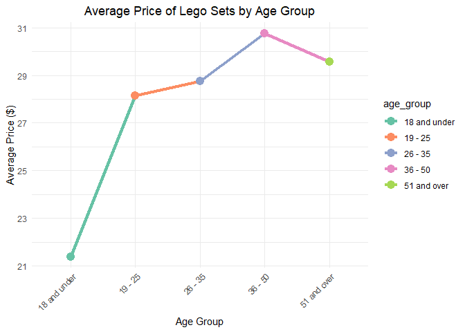

HW 05 - Legos
================
Shirisha Biyyala
2024-10-22

## Load packages and data

``` r
#install.packages("tidyverse")
library(tidyverse)
load("data/lego_sales.rda")
```

``` r
view(lego_sales)
glimpse(lego_sales)
```

    ## Rows: 620
    ## Columns: 14
    ## $ first_name   <chr> "Kimberly", "Neel", "Neel", "Chelsea", "Chelsea", "Chelse…
    ## $ last_name    <chr> "Beckstead", "Garvin", "Garvin", "Bouchard", "Bouchard", …
    ## $ age          <dbl> 24, 35, 35, 41, 41, 41, 19, 19, 37, 37, 19, 19, 20, 36, 3…
    ## $ phone_number <chr> "216-555-2549", "819-555-3189", "819-555-3189", NA, NA, N…
    ## $ set_id       <dbl> 24701, 25626, 24665, 24695, 25626, 24721, 24797, 24701, 2…
    ## $ number       <chr> "76062", "70595", "21031", "31048", "70595", "10831", "75…
    ## $ theme        <chr> "DC Comics Super Heroes", "Ninjago", "Architecture", "Cre…
    ## $ subtheme     <chr> "Mighty Micros", "Rise of the Villains", NA, NA, "Rise of…
    ## $ year         <dbl> 2018, 2018, 2018, 2018, 2018, 2018, 2018, 2018, 2018, 201…
    ## $ name         <chr> "Robin vs. Bane", "Ultra Stealth Raider", "Burj Khalifa",…
    ## $ pieces       <dbl> 77, 1093, 333, 368, 1093, 19, 233, 77, 108, NA, 13, 15, 6…
    ## $ us_price     <dbl> 9.99, 119.99, 39.99, 29.99, 119.99, 9.99, 24.99, 9.99, 9.…
    ## $ image_url    <chr> "http://images.brickset.com/sets/images/76062-1.jpg", "ht…
    ## $ quantity     <dbl> 1, 1, 1, 1, 1, 1, 1, 3, 1, 2, 1, 1, 2, 1, 1, 1, 1, 1, 1, …

``` r
# Get the head of the data set
lego_head <- head(lego_sales)
lego_head
```

    ## # A tibble: 6 × 14
    ##   first_name last_name   age phone_number set_id number theme     subtheme  year
    ##   <chr>      <chr>     <dbl> <chr>         <dbl> <chr>  <chr>     <chr>    <dbl>
    ## 1 Kimberly   Beckstead    24 216-555-2549  24701 76062  DC Comic… Mighty …  2018
    ## 2 Neel       Garvin       35 819-555-3189  25626 70595  Ninjago   Rise of…  2018
    ## 3 Neel       Garvin       35 819-555-3189  24665 21031  Architec… <NA>      2018
    ## 4 Chelsea    Bouchard     41 <NA>          24695 31048  Creator   <NA>      2018
    ## 5 Chelsea    Bouchard     41 <NA>          25626 70595  Ninjago   Rise of…  2018
    ## 6 Chelsea    Bouchard     41 <NA>          24721 10831  Duplo     <NA>      2018
    ## # ℹ 5 more variables: name <chr>, pieces <dbl>, us_price <dbl>,
    ## #   image_url <chr>, quantity <dbl>

``` r
# Get the tail of the data set
lego_tail <- tail(lego_sales)
lego_tail
```

    ## # A tibble: 6 × 14
    ##   first_name last_name   age phone_number set_id number  theme    subtheme  year
    ##   <chr>      <chr>     <dbl> <chr>         <dbl> <chr>   <chr>    <chr>    <dbl>
    ## 1 Natalia    Vonduyke     16 859-555-3818  25922 75149   Star Wa… The For…  2018
    ## 2 Talise     Nieukirk     16 801-555-2343  24902 41556   Mixels   Series 7  2018
    ## 3 Spencer    Morgan       28 784-555-3455  26041 41580   Mixels   Series 9  2018
    ## 4 Spencer    Morgan       28 784-555-3455  26060 5005051 Gear     Digital…  2018
    ## 5 Amelia     Hageman      40 336-555-1950  24702 76063   DC Comi… Mighty …  2018
    ## 6 Amelia     Hageman      40 336-555-1950  24720 10830   Duplo    <NA>      2018
    ## # ℹ 5 more variables: name <chr>, pieces <dbl>, us_price <dbl>,
    ## #   image_url <chr>, quantity <dbl>

## Exercises

### Exercise 1

In this sample, the first three common names of purchasers are
**Jackson**, **Jacob** and **Joseph**.

``` r
lego_sales %>%
  count(first_name) %>%
  arrange(desc(n)) %>%
  slice_max(n, n = 3)
```

    ## # A tibble: 3 × 2
    ##   first_name     n
    ##   <chr>      <int>
    ## 1 Jackson       13
    ## 2 Jacob         11
    ## 3 Joseph        11

### Exercise 2

In this sample, the three most common themes of Lego sets purchased are:

1.  **Star Wars** (75 purchases)
2.  **Nexo Knights** (64 purchases)
3.  **Gear** and **Mixels** (both with 55 purchases each)

``` r
lego_sales %>%
  count(theme) %>%
  arrange(desc(n)) %>%
  slice_max(n, n = 3)
```

    ## # A tibble: 4 × 2
    ##   theme            n
    ##   <chr>        <int>
    ## 1 Star Wars       75
    ## 2 Nexo Knights    64
    ## 3 Gear            55
    ## 4 Mixels          55

### Exercise 3

Among the most common themes of Lego sets purchased, the most common
subtheme is:

- **The Force Awakens** (15 purchases)

``` r
lego_sales %>%
  group_by(theme) %>%
  mutate(theme_count  = n()) %>%  
  ungroup() %>%
  filter(theme_count  == max(theme_count )) %>%  
  count(subtheme) %>%
  slice_max(n, n = 1)
```

    ## # A tibble: 1 × 2
    ##   subtheme              n
    ##   <chr>             <int>
    ## 1 The Force Awakens    15

### Exercise 4

``` r
lego_sales <- lego_sales %>%
  mutate(age_group = case_when(
    age <= 18 ~ "18 and under",
    age >= 19 & age <= 25 ~ "19 - 25",
    age >= 26 & age <= 35 ~ "26 - 35",
    age >= 36 & age <= 50 ~ "36 - 50",
    age > 50 ~ "51 and over"
  ))
```

``` r
#Show sample data with selected columns
lego_sales %>% 
  select(first_name, last_name, age, age_group)
```

    ## # A tibble: 620 × 4
    ##    first_name last_name        age age_group
    ##    <chr>      <chr>          <dbl> <chr>    
    ##  1 Kimberly   Beckstead         24 19 - 25  
    ##  2 Neel       Garvin            35 26 - 35  
    ##  3 Neel       Garvin            35 26 - 35  
    ##  4 Chelsea    Bouchard          41 36 - 50  
    ##  5 Chelsea    Bouchard          41 36 - 50  
    ##  6 Chelsea    Bouchard          41 36 - 50  
    ##  7 Bryanna    Welsh             19 19 - 25  
    ##  8 Bryanna    Welsh             19 19 - 25  
    ##  9 Caleb      Garcia-Wideman    37 36 - 50  
    ## 10 Caleb      Garcia-Wideman    37 36 - 50  
    ## # ℹ 610 more rows

### Exercise 5

The age group with the highest purchases is:

- **36 - 50** (313 purchases)

``` r
lego_sales %>%
  group_by(age_group) %>%
  summarise(highest_purchases = sum(quantity)) %>%
  arrange(desc(highest_purchases)) %>%
  slice_max(highest_purchases, n = 1)
```

    ## # A tibble: 1 × 2
    ##   age_group highest_purchases
    ##   <chr>                 <dbl>
    ## 1 36 - 50                 313

### Exercise 6

The total amount spent by the age group is **36 - 50** (\$9,532.87)

``` r
lego_sales %>%
  group_by(age_group) %>%
  summarise(total_spent = sum(us_price * quantity)) %>%
  arrange(desc(total_spent)) %>%
  slice_max(total_spent, n = 1)
```

    ## # A tibble: 1 × 2
    ##   age_group total_spent
    ##   <chr>           <dbl>
    ## 1 36 - 50         9533.

### Exercise 7

The Lego theme that has made the most money for Lego is **Star Wars**

``` r
lego_sales %>%
  group_by(theme) %>%
  summarise(total_revenue = sum(us_price * quantity)) %>%
  arrange(desc(total_revenue)) %>%
  slice_max(total_revenue, n = 1)
```

    ## # A tibble: 1 × 2
    ##   theme     total_revenue
    ##   <chr>             <dbl>
    ## 1 Star Wars         4448.

### Exercise 8

``` r
lego_sales %>%
  mutate(area_code = str_sub(phone_number, 1, 3)) %>%
  group_by(area_code) %>%
  summarise(total_spent = sum(us_price * quantity)) %>%
  arrange(desc(total_spent)) %>%
  slice_max(total_spent, n = 1)
```

    ## # A tibble: 1 × 2
    ##   area_code total_spent
    ##   <chr>           <dbl>
    ## 1 <NA>            3993.

The **NA value** represents missing or improperly formatted phone
numbers, which cannot be reliably analyzed. Therefore, we need to clean
the dataset by filtering out any NA values to ensure accurate reporting.

``` r
lego_sales %>%
  mutate(area_code = str_sub(phone_number, 1, 3)) %>%
  filter(!is.na(area_code)) %>%  # Remove NA values
  group_by(area_code) %>%
  summarise(total_spent = sum(us_price * quantity, na.rm = TRUE)) %>%
  arrange(desc(total_spent)) %>%
  slice_max(total_spent, n = 1)  # Get the area code with the highest total spent
```

    ## # A tibble: 1 × 2
    ##   area_code total_spent
    ##   <chr>           <dbl>
    ## 1 956              720.

The area code that has spent the most money on Legos, excluding invalid
entries, is **956**, with a total of **\$719.96**. This indicates that
customers with the area code 956 have made significant purchases.

### Exercise 9

#### a. What is the average price of Lego sets purchased by each age group?

``` r
# Calculate the average price of Lego sets by age group
average_price_by_age <- lego_sales %>%
  mutate(age_group = case_when(
    age <= 18 ~ "18 and under",
    age >= 19 & age <= 25 ~ "19 - 25",
    age >= 26 & age <= 35 ~ "26 - 35",
    age >= 36 & age <= 50 ~ "36 - 50",
    age > 50 ~ "51 and over"
  )) %>%
  group_by(age_group) %>%
  summarise(average_price = mean(us_price, na.rm = TRUE)) %>%
  arrange(age_group)

# Create a line graph for average price by age group with vivid colors
ggplot(average_price_by_age, aes(x = age_group, y = average_price, group = 1, color = age_group)) +
  geom_line(size = 1.5) +  # Set the line size
  geom_point(size = 4) +    # Add points for each age group
  scale_color_brewer(palette = "Set2") +
  labs(title = "Average Price of Lego Sets by Age Group",
       x = "Age Group",
       y = "Average Price ($)") +
  theme_minimal() +
  theme(axis.text.x = element_text(angle = 45, hjust = 1),
        plot.title = element_text(hjust = 0.5))  # Center the title
```

    ## Warning: Using `size` aesthetic for lines was deprecated in ggplot2 3.4.0.
    ## ℹ Please use `linewidth` instead.
    ## This warning is displayed once every 8 hours.
    ## Call `lifecycle::last_lifecycle_warnings()` to see where this warning was
    ## generated.

<!-- -->
