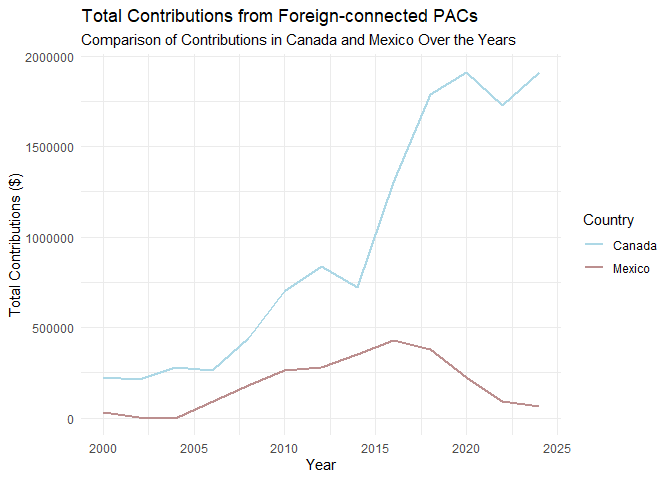
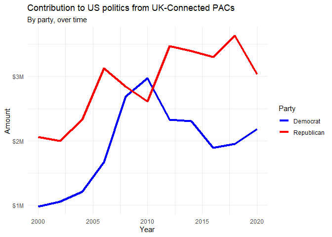

Midterm 02
================
Shirisha Biyyala
2024-11-09

## Load packages and data

``` r
library(tidyverse)
library(robotstxt)
library(rvest)
library(scales)
library(stringr)
library(dplyr)
library(tidyr)
library(ggplot2)
```

``` r
library(robotstxt)
paths_allowed("https://www.opensecrets.org")
```

    ##  www.opensecrets.org

    ## [1] TRUE

## Exercises

``` r
# function: scrape_pac ---------------------------------------------------------

scrape_pac <- function(url) {

  # read the page
  page <- read_html(url)

  # extract the table
  # select node .DataTable-Partial (identified using the HTML code)
  pac <- page %>%
    html_node(".DataTable-Partial") %>%
    
    # parse table at node td into a data frame
    # table has a head and empty cells should be filled with NAs
    html_table("td", header = TRUE, trim = TRUE) %>%
    
    # convert to a tibble
    as_tibble()

  # rename variables
  pac <- pac %>%
    
    # rename columns (new name = old name)
    rename(
      name = `PAC Name (Affiliate)` ,
      country_parent = `Country of Origin/Parent Company`,
      total = `Total`,
      dems = `Dems`,
      repubs = `Repubs` 
    )

  # add year
  pac <- pac %>%
    
    # extract last 4 characters of the URL and save as year
    mutate(year = substr(url, nchar(url) - 3, nchar(url)))

  # return data frame
  pac

}

# test function ----------------------------------------------------------------

url_2022 <- "https://www.opensecrets.org/political-action-committees-pacs/foreign-connected-pacs/2022"
pac_2022 <- scrape_pac(url_2022)


url_2020 <- "https://www.opensecrets.org/political-action-committees-pacs/foreign-connected-pacs/2020"
pac_2020 <- scrape_pac(url_2020)

url_2018 <- "https://www.opensecrets.org/political-action-committees-pacs/foreign-connected-pacs/2018"
pac_2018 <- scrape_pac(url_2018)

# list of urls -----------------------------------------------------------------

# first part of url
root <- "https://www.opensecrets.org/political-action-committees-pacs/foreign-connected-pacs/"

# second part of url (election years as a sequence)
year <- seq(from = 2000, to = 2024, by = 2)

# construct urls by pasting first and second parts together
urls <- paste0(root, year)

# map the scrape_pac function over list of urls --------------------------------

pac_all <- map_dfr(urls, scrape_pac)

# write data -------------------------------------------------------------------

# Set the  directory to the exam-02 folder
setwd("C:/Users/shiri/OneDrive/Documents/RStudio/exam-02")

# Write the data to pac-all.csv
write_csv(pac_all, file = "pac-all.csv")
```

#### References

1.  <https://www.geeksforgeeks.org/extract-first-or-last-n-characters-from-string-in-r/>

### Exercise 1

``` r
# Load pac-all.csv
pac_all <- read_csv("pac-all.csv")

# Data description
head(pac_all)
```

    ## # A tibble: 6 × 6
    ##   name                      country_parent              total dems  repubs  year
    ##   <chr>                     <chr>                       <chr> <chr> <chr>  <dbl>
    ## 1 7-Eleven                  Japan/Ito-Yokado            $8,5… $1,5… $7,000  2000
    ## 2 ABB Group                 Switzerland/Asea Brown Bov… $46,… $17,… $28,5…  2000
    ## 3 Accenture                 UK/Accenture plc            $75,… $23,… $52,9…  2000
    ## 4 ACE INA                   UK/ACE Group                $38,… $12,… $26,0…  2000
    ## 5 Acuson Corp (Siemens AG)  Germany/Siemens AG          $2,0… $2,0… $0      2000
    ## 6 Adtranz (DaimlerChrysler) Germany/DaimlerChrysler AG  $10,… $10,… $500    2000

``` r
glimpse(pac_all)
```

    ## Rows: 2,638
    ## Columns: 6
    ## $ name           <chr> "7-Eleven", "ABB Group", "Accenture", "ACE INA", "Acuso…
    ## $ country_parent <chr> "Japan/Ito-Yokado", "Switzerland/Asea Brown Boveri", "U…
    ## $ total          <chr> "$8,500", "$46,000", "$75,984", "$38,500", "$2,000", "$…
    ## $ dems           <chr> "$1,500", "$17,000", "$23,000", "$12,500", "$2,000", "$…
    ## $ repubs         <chr> "$7,000", "$28,500", "$52,984", "$26,000", "$0", "$500"…
    ## $ year           <dbl> 2000, 2000, 2000, 2000, 2000, 2000, 2000, 2000, 2000, 2…

``` r
view(pac_all)

# Report number of observations and variables
n_obs_vars <- str_glue("The dataset has {nrow(pac_all)} observations and {ncol(pac_all)} variables.")
n_obs_vars
```

    ## The dataset has 2638 observations and 6 variables.

The dataset has **2638** observations and **6** variables.

## Data Cleaning

### Exercise 2

``` r
# Use separate_wider_delim() to split the country_parent column
pac_all <- pac_all %>%
  separate_wider_delim(country_parent, 
                       delim = "/", 
                       names = c("country", "parent_company"), 
                       too_many = "merge")

# Print the top 10 rows to check the result
head(pac_all, 10)
```

    ## # A tibble: 10 × 7
    ##    name                          country parent_company total dems  repubs  year
    ##    <chr>                         <chr>   <chr>          <chr> <chr> <chr>  <dbl>
    ##  1 7-Eleven                      Japan   Ito-Yokado     $8,5… $1,5… $7,000  2000
    ##  2 ABB Group                     Switze… Asea Brown Bo… $46,… $17,… $28,5…  2000
    ##  3 Accenture                     UK      Accenture plc  $75,… $23,… $52,9…  2000
    ##  4 ACE INA                       UK      ACE Group      $38,… $12,… $26,0…  2000
    ##  5 Acuson Corp (Siemens AG)      Germany Siemens AG     $2,0… $2,0… $0      2000
    ##  6 Adtranz (DaimlerChrysler)     Germany DaimlerChrysl… $10,… $10,… $500    2000
    ##  7 AE Staley Manufacturing (Tat… UK      Tate & Lyle    $24,… $10,… $14,0…  2000
    ##  8 AEGON USA (AEGON NV)          Nether… Aegon NV       $58,… $10,… $47,7…  2000
    ##  9 AIM Management Group          UK      AMVESCAP       $25,… $10,… $15,0…  2000
    ## 10 Air Liquide America           France  L'Air Liquide… $0    $0    $0      2000

In this code chunk, we use the `separate_wider_delim()` function to
split the `country_parent` column in the `pac_all` dataset into two new
columns: `country` and `parent_company`, using “/” as the delimiter. If
there are more than two parts after splitting, the extra components are
merged into the `parent_company` column. Finally, we print the first 10
rows of the modified dataset to verify the changes.

### Exercise 3

``` r
# Convert contribution amounts to numeric
# Clean the columns: remove '$' and ',' then convert to numeric
pac_all <- pac_all %>%
  mutate(
    total = str_remove_all(total, "\\$"),  # Remove dollar sign
    total = str_remove_all(total, ","),    # Remove commas 
    total = as.numeric(total),             # Convert to numeric
    
    dems = str_remove_all(dems, "\\$"),    
    dems = str_remove_all(dems, ","),      
    dems = as.numeric(dems),               
    
    repubs = str_remove_all(repubs, "\\$"),  
    repubs = str_remove_all(repubs, ","),    
    repubs = as.numeric(repubs)             
  )

# Print the top 10 rows to verify the changes
head(pac_all, 10)
```

    ## # A tibble: 10 × 7
    ##    name                          country parent_company total  dems repubs  year
    ##    <chr>                         <chr>   <chr>          <dbl> <dbl>  <dbl> <dbl>
    ##  1 7-Eleven                      Japan   Ito-Yokado      8500  1500   7000  2000
    ##  2 ABB Group                     Switze… Asea Brown Bo… 46000 17000  28500  2000
    ##  3 Accenture                     UK      Accenture plc  75984 23000  52984  2000
    ##  4 ACE INA                       UK      ACE Group      38500 12500  26000  2000
    ##  5 Acuson Corp (Siemens AG)      Germany Siemens AG      2000  2000      0  2000
    ##  6 Adtranz (DaimlerChrysler)     Germany DaimlerChrysl… 10500 10000    500  2000
    ##  7 AE Staley Manufacturing (Tat… UK      Tate & Lyle    24000 10000  14000  2000
    ##  8 AEGON USA (AEGON NV)          Nether… Aegon NV       58250 10500  47750  2000
    ##  9 AIM Management Group          UK      AMVESCAP       25000 10000  15000  2000
    ## 10 Air Liquide America           France  L'Air Liquide…     0     0      0  2000

In this code, the `total`, `dems`, and `repubs` columns contained
monetary values formatted as strings with dollar signs (`$`) and commas
(`,`), which made it difficult to perform calculations. To clean the
data, we used the `str_remove_all()` function to remove all dollar signs
and commas from each of these columns. After cleaning, we converted the
resulting strings into numeric values using `as.numeric()`. The data is
now in a format suitable for analysis, and we printed the top 10 rows to
confirm that the changes were applied correctly.

#### References:

1.  <https://www.geeksforgeeks.org/remove-all-special-characters-from-string-in-r/>
2.  <https://stackoverflow.com/questions/10294284/remove-all-special-characters-from-a-string-in-r>

### Exercise 4

``` r
# Filter data for Canada and Mexico, group by year and country
can_vs_mexico <- pac_all %>%
  filter(country %in% c("Canada", "Mexico")) %>%
  group_by(year, country) %>%
  summarize(total_contributions = sum(total, na.rm = TRUE))

# Create the line plot
ggplot(can_vs_mexico, aes(x = year, y = total_contributions, color = country)) +
  geom_line(size = 1) +                   # Line plot with line width = 1
  labs(
    title = "Total Contributions from Foreign-connected PACs",
    subtitle = "Comparison of Contributions in Canada and Mexico Over the Years",
    x = "Year",
    y = "Total Contributions ($)",
    color = "Country"
  ) +
  theme_minimal() +                       
  scale_color_manual(values = c("Canada" = "lightblue", "Mexico" = "rosybrown"))  
```

<!-- -->

#### Interpretation

The plot reveals a positive correlation between contributions and years
from 2000 to 2015 for both Canada and Mexico. However, after 2015, the
trajectories of the two countries diverge. Canada experienced a
significant and sustained increase in contributions, suggesting a surge
in PAC activity. In contrast, Mexico saw a further decline, indicating a
weakening of foreign-connected PAC influence.

This graph underscores the distinct patterns of political contributions
in Canada and Mexico, reflecting how foreign-linked PACs have shaped
political financing in each country. It provides a clear comparison of
the evolving trends, with Canada’s continued growth in contributions
post-2015 and Mexico’s decline. The differing trends highlight the
shifting political dynamics and the varying role of foreign-connected
PACs in these two countries.

### Exercise 5

``` r
# Step 1: Filter for UK contributions
pac_all_uk <- pac_all %>%
  filter(country == "UK", year <= 2020)

# Step 2: Reshape data from wide to long format (pivot longer)
pac_all_uk_long <- pac_all_uk %>%
  pivot_longer(cols = c(dems, repubs), 
               names_to = "party", 
               values_to = "amount")

# Step 3: Group by year and party, then summarize total contributions
pac_all_uk_summary <- pac_all_uk_long %>%
  group_by(year, party) %>%
  summarize(total_contributions = sum(amount, na.rm = TRUE)) %>%
  ungroup()

# Step 4: Plot the data
ggplot(pac_all_uk_summary, aes(x = year, y = total_contributions, color = party, group = party)) +
  geom_line(size = 1.5) +  # Line plot for contributions
  scale_y_continuous(labels = label_dollar(scale = 1e-6, suffix = "M")) +  # Format y-axis labels in millions
  labs(
    title = "Contribution to US politics from UK-Connected PACs",
    subtitle = "By party, over time",
    x = "Year",
    y = "Amount",
    color = "Party"
  ) +
  scale_color_manual(values = c("dems" = "blue", "repubs" = "red"), 
                     labels = c("Democrat", "Republican")) +
  theme_minimal() +
  theme(legend.position = "right")
```

<!-- -->

#### Interpretation

### Interpretation:

The graph compares contributions to US politics from **UK-connected
PACs** for both **Democratic** and **Republican** parties over time.
Contributions from the **Democratic party** were generally low but
**peaked in 2010**, while contributions from the **Republican party**
declined. This trend could reflect broader political dynamics in the US,
such as the aftermath of the **2008 financial crisis** and the shifting
political landscape.

The spike in **Democratic contributions in 2010** may be attributed to
significant political events like the **Affordable Care Act** push
during President Obama’s term, while the decline in **Republican
contributions** could point to a period of internal challenges within
the party, including the rise of the **Tea Party movement** and the
shifting political priorities of the time.
