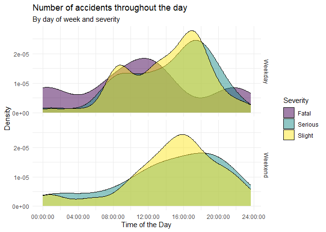

HW 03 - Road traffic accidents
================
Shirisha Biyyala
2024-09-25

## Load packages and data

``` r
library(tidyverse)

load("data/accidents.rda")
```

## Exercises

### Exercise 1

The dataset has 768 observations.

### Exercise 2

Each row in the dataset represents an individual accident or crash
incident, with each column providing specific details about that event.
These details typically include:

- **ID**: Unique identifier for the accident.
- **Easting/Northing**: Geographic coordinates for mapping.
- **Severity**: Level of severity (e.g., slight, serious).
- **Vehicles**: Number of vehicles involved.
- **Casualties**: Number of injuries or fatalities.
- **Date**: When the accident occurred.
- etc

It’s a record of specific accident events with all relevant information.

``` r
view(accidents)
```

<div style="overflow-x: auto; max-width: 100%; height: 300px;">

<table>
<thead>
<tr>
<th style="text-align:left;">
id
</th>
<th style="text-align:right;">
easting
</th>
<th style="text-align:right;">
northing
</th>
<th style="text-align:right;">
longitude
</th>
<th style="text-align:right;">
latitude
</th>
<th style="text-align:right;">
police_force
</th>
<th style="text-align:left;">
severity
</th>
<th style="text-align:right;">
vehicles
</th>
<th style="text-align:right;">
casualties
</th>
<th style="text-align:left;">
date
</th>
<th style="text-align:left;">
day_of_week
</th>
<th style="text-align:left;">
time
</th>
<th style="text-align:right;">
district
</th>
<th style="text-align:left;">
highway
</th>
<th style="text-align:left;">
first_road_class
</th>
<th style="text-align:left;">
first_road_number
</th>
<th style="text-align:left;">
road_type
</th>
<th style="text-align:right;">
speed_limit
</th>
<th style="text-align:left;">
junction_detail
</th>
<th style="text-align:left;">
junction_control
</th>
<th style="text-align:left;">
second_road_class
</th>
<th style="text-align:left;">
second_road_number
</th>
<th style="text-align:left;">
ped_cross_human
</th>
<th style="text-align:left;">
ped_cross_physical
</th>
<th style="text-align:left;">
light
</th>
<th style="text-align:left;">
weather
</th>
<th style="text-align:left;">
road_surface
</th>
<th style="text-align:left;">
special_condition
</th>
<th style="text-align:left;">
hazard
</th>
<th style="text-align:right;">
urban_rural
</th>
<th style="text-align:left;">
police
</th>
</tr>
</thead>
<tbody>
<tr>
<td style="text-align:left;">
2018950000002
</td>
<td style="text-align:right;">
327174
</td>
<td style="text-align:right;">
670941
</td>
<td style="text-align:right;">
-3.167032
</td>
<td style="text-align:right;">
55.92600
</td>
<td style="text-align:right;">
95
</td>
<td style="text-align:left;">
Slight
</td>
<td style="text-align:right;">
1
</td>
<td style="text-align:right;">
1
</td>
<td style="text-align:left;">
31/12/2018
</td>
<td style="text-align:left;">
Monday
</td>
<td style="text-align:left;">
14:59:00
</td>
<td style="text-align:right;">
923
</td>
<td style="text-align:left;">
S12000036
</td>
<td style="text-align:left;">
Unclassified
</td>
<td style="text-align:left;">
0
</td>
<td style="text-align:left;">
Single carriageway
</td>
<td style="text-align:right;">
20
</td>
<td style="text-align:left;">
Other junction
</td>
<td style="text-align:left;">
Give way or uncontrolled
</td>
<td style="text-align:left;">
Unclassified
</td>
<td style="text-align:left;">
0
</td>
<td style="text-align:left;">
None within 50 metres
</td>
<td style="text-align:left;">
Pedestrian phase at traffic signal junction
</td>
<td style="text-align:left;">
Daylight
</td>
<td style="text-align:left;">
Fine + no high winds
</td>
<td style="text-align:left;">
Dry
</td>
<td style="text-align:left;">
None
</td>
<td style="text-align:left;">
None
</td>
<td style="text-align:right;">
1
</td>
<td style="text-align:left;">
Yes
</td>
</tr>
<tr>
<td style="text-align:left;">
2018950000006
</td>
<td style="text-align:right;">
324874
</td>
<td style="text-align:right;">
672457
</td>
<td style="text-align:right;">
-3.204252
</td>
<td style="text-align:right;">
55.93926
</td>
<td style="text-align:right;">
95
</td>
<td style="text-align:left;">
Slight
</td>
<td style="text-align:right;">
1
</td>
<td style="text-align:right;">
1
</td>
<td style="text-align:left;">
30/12/2018
</td>
<td style="text-align:left;">
Sunday
</td>
<td style="text-align:left;">
12:50:00
</td>
<td style="text-align:right;">
923
</td>
<td style="text-align:left;">
S12000036
</td>
<td style="text-align:left;">
Unclassified
</td>
<td style="text-align:left;">
0
</td>
<td style="text-align:left;">
Single carriageway
</td>
<td style="text-align:right;">
20
</td>
<td style="text-align:left;">
Other junction
</td>
<td style="text-align:left;">
Give way or uncontrolled
</td>
<td style="text-align:left;">
Missing / Out of range
</td>
<td style="text-align:left;">
-1
</td>
<td style="text-align:left;">
None within 50 metres
</td>
<td style="text-align:left;">
No physical crossing facilities within 50 metres
</td>
<td style="text-align:left;">
Daylight
</td>
<td style="text-align:left;">
Fine + no high winds
</td>
<td style="text-align:left;">
Dry
</td>
<td style="text-align:left;">
None
</td>
<td style="text-align:left;">
None
</td>
<td style="text-align:right;">
1
</td>
<td style="text-align:left;">
Yes
</td>
</tr>
<tr>
<td style="text-align:left;">
2018950000012
</td>
<td style="text-align:right;">
330500
</td>
<td style="text-align:right;">
671750
</td>
<td style="text-align:right;">
-3.114026
</td>
<td style="text-align:right;">
55.93376
</td>
<td style="text-align:right;">
95
</td>
<td style="text-align:left;">
Slight
</td>
<td style="text-align:right;">
2
</td>
<td style="text-align:right;">
2
</td>
<td style="text-align:left;">
03/01/2018
</td>
<td style="text-align:left;">
Wednesday
</td>
<td style="text-align:left;">
14:34:00
</td>
<td style="text-align:right;">
923
</td>
<td style="text-align:left;">
S12000036
</td>
<td style="text-align:left;">
A(M) road
</td>
<td style="text-align:left;">
6095
</td>
<td style="text-align:left;">
Single carriageway
</td>
<td style="text-align:right;">
20
</td>
<td style="text-align:left;">
Crossroads
</td>
<td style="text-align:left;">
Auto traffic signal
</td>
<td style="text-align:left;">
A-road
</td>
<td style="text-align:left;">
6106
</td>
<td style="text-align:left;">
None within 50 metres
</td>
<td style="text-align:left;">
Pedestrian phase at traffic signal junction
</td>
<td style="text-align:left;">
Daylight
</td>
<td style="text-align:left;">
Fine + no high winds
</td>
<td style="text-align:left;">
Wet or damp
</td>
<td style="text-align:left;">
None
</td>
<td style="text-align:left;">
None
</td>
<td style="text-align:right;">
1
</td>
<td style="text-align:left;">
Yes
</td>
</tr>
<tr>
<td style="text-align:left;">
2018950000015
</td>
<td style="text-align:right;">
321890
</td>
<td style="text-align:right;">
671640
</td>
<td style="text-align:right;">
-3.251772
</td>
<td style="text-align:right;">
55.93145
</td>
<td style="text-align:right;">
95
</td>
<td style="text-align:left;">
Slight
</td>
<td style="text-align:right;">
3
</td>
<td style="text-align:right;">
1
</td>
<td style="text-align:left;">
01/01/2018
</td>
<td style="text-align:left;">
Monday
</td>
<td style="text-align:left;">
02:25:00
</td>
<td style="text-align:right;">
923
</td>
<td style="text-align:left;">
S12000036
</td>
<td style="text-align:left;">
A(M) road
</td>
<td style="text-align:left;">
71
</td>
<td style="text-align:left;">
Single carriageway
</td>
<td style="text-align:right;">
30
</td>
<td style="text-align:left;">
Not within 20 metres of junction
</td>
<td style="text-align:left;">
Missing / Out of range
</td>
<td style="text-align:left;">
Missing / Out of range
</td>
<td style="text-align:left;">
0
</td>
<td style="text-align:left;">
None within 50 metres
</td>
<td style="text-align:left;">
No physical crossing facilities within 50 metres
</td>
<td style="text-align:left;">
Darkness - lights lit
</td>
<td style="text-align:left;">
Raining + no high winds
</td>
<td style="text-align:left;">
Wet or damp
</td>
<td style="text-align:left;">
None
</td>
<td style="text-align:left;">
None
</td>
<td style="text-align:right;">
1
</td>
<td style="text-align:left;">
Yes
</td>
</tr>
<tr>
<td style="text-align:left;">
2018950000017
</td>
<td style="text-align:right;">
320120
</td>
<td style="text-align:right;">
669330
</td>
<td style="text-align:right;">
-3.279409
</td>
<td style="text-align:right;">
55.91041
</td>
<td style="text-align:right;">
95
</td>
<td style="text-align:left;">
Slight
</td>
<td style="text-align:right;">
2
</td>
<td style="text-align:right;">
1
</td>
<td style="text-align:left;">
04/01/2018
</td>
<td style="text-align:left;">
Thursday
</td>
<td style="text-align:left;">
09:00:00
</td>
<td style="text-align:right;">
923
</td>
<td style="text-align:left;">
S12000036
</td>
<td style="text-align:left;">
Unclassified
</td>
<td style="text-align:left;">
0
</td>
<td style="text-align:left;">
Roundabout
</td>
<td style="text-align:right;">
30
</td>
<td style="text-align:left;">
Roundabout
</td>
<td style="text-align:left;">
Give way or uncontrolled
</td>
<td style="text-align:left;">
Unclassified
</td>
<td style="text-align:left;">
0
</td>
<td style="text-align:left;">
None within 50 metres
</td>
<td style="text-align:left;">
No physical crossing facilities within 50 metres
</td>
<td style="text-align:left;">
Daylight
</td>
<td style="text-align:left;">
Fine + no high winds
</td>
<td style="text-align:left;">
Wet or damp
</td>
<td style="text-align:left;">
None
</td>
<td style="text-align:left;">
None
</td>
<td style="text-align:right;">
1
</td>
<td style="text-align:left;">
Yes
</td>
</tr>
<tr>
<td style="text-align:left;">
2018950000018
</td>
<td style="text-align:right;">
331752
</td>
<td style="text-align:right;">
667988
</td>
<td style="text-align:right;">
-3.093039
</td>
<td style="text-align:right;">
55.90015
</td>
<td style="text-align:right;">
95
</td>
<td style="text-align:left;">
Slight
</td>
<td style="text-align:right;">
3
</td>
<td style="text-align:right;">
1
</td>
<td style="text-align:left;">
03/01/2018
</td>
<td style="text-align:left;">
Wednesday
</td>
<td style="text-align:left;">
14:15:00
</td>
<td style="text-align:right;">
923
</td>
<td style="text-align:left;">
S12000036
</td>
<td style="text-align:left;">
A(M) road
</td>
<td style="text-align:left;">
720
</td>
<td style="text-align:left;">
Roundabout
</td>
<td style="text-align:right;">
70
</td>
<td style="text-align:left;">
Roundabout
</td>
<td style="text-align:left;">
Auto traffic signal
</td>
<td style="text-align:left;">
A-road
</td>
<td style="text-align:left;">
720
</td>
<td style="text-align:left;">
None within 50 metres
</td>
<td style="text-align:left;">
No physical crossing facilities within 50 metres
</td>
<td style="text-align:left;">
Daylight
</td>
<td style="text-align:left;">
Fine + no high winds
</td>
<td style="text-align:left;">
Wet or damp
</td>
<td style="text-align:left;">
None
</td>
<td style="text-align:left;">
None
</td>
<td style="text-align:right;">
2
</td>
<td style="text-align:left;">
Yes
</td>
</tr>
</tbody>
</table>

</div>

### Exercise 3

#### Accident Density Plot by Time and Severity

This plot shows the **density distribution of accidents throughout the
day** based on the time they occurred, separated into **Weekdays and
Weekends**. The fill represents the **severity of the accidents** (e.g.,
Slight, Serious, Fatal).

- **Facets**: The data is divided into two facets: **Weekday** and
  **Weekend**, allowing for a comparison of accident patterns between
  these time frames.
- **X-axis**: Displays the time of day when accidents happened.
- **Y-axis**: Represents the density of accidents, showing the
  probability of accidents happening at different times.
- **Fill Colors**: The different accident severities are indicated by
  the colors, based on the `viridis` color palette.

By visualizing this, we can identify if certain times of the day (e.g.,
rush hours) are associated with higher accident severity and if weekends
differ from weekdays in terms of accident distribution.

``` r
accidents %>%
  mutate(day_of_week_type = if_else(day_of_week %in% c("Saturday", "Sunday"), "Weekend", "Weekday")) %>%
  ggplot(aes(x = time, fill = severity)) +  
  geom_density(adjust = 1, alpha = 0.5) +
  facet_grid(day_of_week_type ~ .) +
  scale_fill_viridis_d() +
  labs(title = "Number of accidents throughout the day",
       subtitle = "By day of week and severity",
       x = "Time of the Day",
       y = "Density",
       fill = "Severity") +
    theme_minimal()
```

<!-- -->

### Exercise 4

Remove this text, and add your answer for Exercise 4 here.

``` r
# remove this comment and add the code for Exercise 4 here
```
