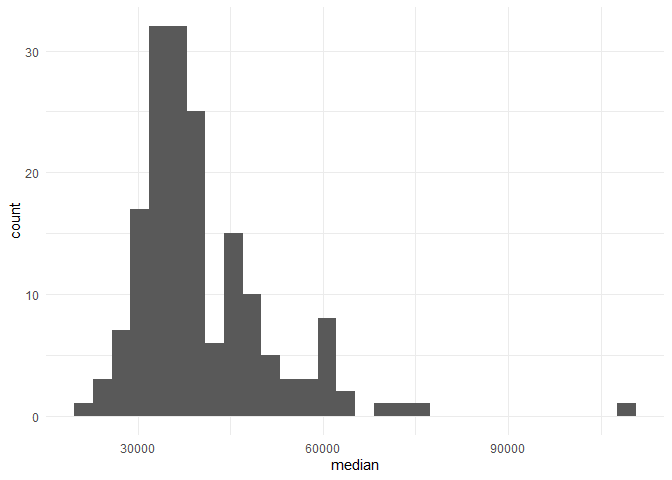
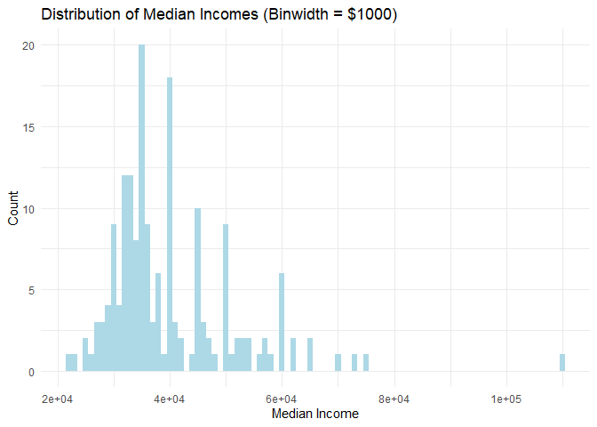
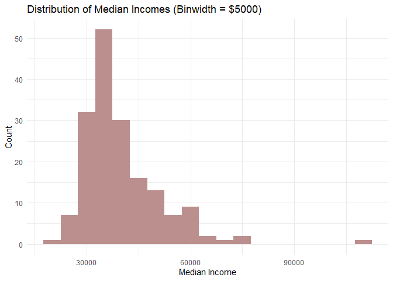

HW 04 - What should I major in?
================
Shirisha Biyyala
2024-09-30

## Load packages and data

``` r
library(tidyverse)
library(scales)
library(fivethirtyeight)
```

``` r
#glimpse(college_recent_grads)
#?college_recent_grads
#view(college_recent_grads)
```

<div style="overflow-x: auto; max-width: 100%; height: 300px;">

<table>
<thead>
<tr>
<th style="text-align:right;">
rank
</th>
<th style="text-align:right;">
major_code
</th>
<th style="text-align:left;">
major
</th>
<th style="text-align:left;">
major_category
</th>
<th style="text-align:right;">
total
</th>
<th style="text-align:right;">
sample_size
</th>
<th style="text-align:right;">
men
</th>
<th style="text-align:right;">
women
</th>
<th style="text-align:right;">
sharewomen
</th>
<th style="text-align:right;">
employed
</th>
<th style="text-align:right;">
employed_fulltime
</th>
<th style="text-align:right;">
employed_parttime
</th>
<th style="text-align:right;">
employed_fulltime_yearround
</th>
<th style="text-align:right;">
unemployed
</th>
<th style="text-align:right;">
unemployment_rate
</th>
<th style="text-align:right;">
p25th
</th>
<th style="text-align:right;">
median
</th>
<th style="text-align:right;">
p75th
</th>
<th style="text-align:right;">
college_jobs
</th>
<th style="text-align:right;">
non_college_jobs
</th>
<th style="text-align:right;">
low_wage_jobs
</th>
</tr>
</thead>
<tbody>
<tr>
<td style="text-align:right;">
1
</td>
<td style="text-align:right;">
2419
</td>
<td style="text-align:left;">
Petroleum Engineering
</td>
<td style="text-align:left;">
Engineering
</td>
<td style="text-align:right;">
2339
</td>
<td style="text-align:right;">
36
</td>
<td style="text-align:right;">
2057
</td>
<td style="text-align:right;">
282
</td>
<td style="text-align:right;">
0.1205643
</td>
<td style="text-align:right;">
1976
</td>
<td style="text-align:right;">
1849
</td>
<td style="text-align:right;">
270
</td>
<td style="text-align:right;">
1207
</td>
<td style="text-align:right;">
37
</td>
<td style="text-align:right;">
0.0183805
</td>
<td style="text-align:right;">
95000
</td>
<td style="text-align:right;">
110000
</td>
<td style="text-align:right;">
125000
</td>
<td style="text-align:right;">
1534
</td>
<td style="text-align:right;">
364
</td>
<td style="text-align:right;">
193
</td>
</tr>
<tr>
<td style="text-align:right;">
2
</td>
<td style="text-align:right;">
2416
</td>
<td style="text-align:left;">
Mining And Mineral Engineering
</td>
<td style="text-align:left;">
Engineering
</td>
<td style="text-align:right;">
756
</td>
<td style="text-align:right;">
7
</td>
<td style="text-align:right;">
679
</td>
<td style="text-align:right;">
77
</td>
<td style="text-align:right;">
0.1018519
</td>
<td style="text-align:right;">
640
</td>
<td style="text-align:right;">
556
</td>
<td style="text-align:right;">
170
</td>
<td style="text-align:right;">
388
</td>
<td style="text-align:right;">
85
</td>
<td style="text-align:right;">
0.1172414
</td>
<td style="text-align:right;">
55000
</td>
<td style="text-align:right;">
75000
</td>
<td style="text-align:right;">
90000
</td>
<td style="text-align:right;">
350
</td>
<td style="text-align:right;">
257
</td>
<td style="text-align:right;">
50
</td>
</tr>
<tr>
<td style="text-align:right;">
3
</td>
<td style="text-align:right;">
2415
</td>
<td style="text-align:left;">
Metallurgical Engineering
</td>
<td style="text-align:left;">
Engineering
</td>
<td style="text-align:right;">
856
</td>
<td style="text-align:right;">
3
</td>
<td style="text-align:right;">
725
</td>
<td style="text-align:right;">
131
</td>
<td style="text-align:right;">
0.1530374
</td>
<td style="text-align:right;">
648
</td>
<td style="text-align:right;">
558
</td>
<td style="text-align:right;">
133
</td>
<td style="text-align:right;">
340
</td>
<td style="text-align:right;">
16
</td>
<td style="text-align:right;">
0.0240964
</td>
<td style="text-align:right;">
50000
</td>
<td style="text-align:right;">
73000
</td>
<td style="text-align:right;">
105000
</td>
<td style="text-align:right;">
456
</td>
<td style="text-align:right;">
176
</td>
<td style="text-align:right;">
0
</td>
</tr>
<tr>
<td style="text-align:right;">
4
</td>
<td style="text-align:right;">
2417
</td>
<td style="text-align:left;">
Naval Architecture And Marine Engineering
</td>
<td style="text-align:left;">
Engineering
</td>
<td style="text-align:right;">
1258
</td>
<td style="text-align:right;">
16
</td>
<td style="text-align:right;">
1123
</td>
<td style="text-align:right;">
135
</td>
<td style="text-align:right;">
0.1073132
</td>
<td style="text-align:right;">
758
</td>
<td style="text-align:right;">
1069
</td>
<td style="text-align:right;">
150
</td>
<td style="text-align:right;">
692
</td>
<td style="text-align:right;">
40
</td>
<td style="text-align:right;">
0.0501253
</td>
<td style="text-align:right;">
43000
</td>
<td style="text-align:right;">
70000
</td>
<td style="text-align:right;">
80000
</td>
<td style="text-align:right;">
529
</td>
<td style="text-align:right;">
102
</td>
<td style="text-align:right;">
0
</td>
</tr>
<tr>
<td style="text-align:right;">
5
</td>
<td style="text-align:right;">
2405
</td>
<td style="text-align:left;">
Chemical Engineering
</td>
<td style="text-align:left;">
Engineering
</td>
<td style="text-align:right;">
32260
</td>
<td style="text-align:right;">
289
</td>
<td style="text-align:right;">
21239
</td>
<td style="text-align:right;">
11021
</td>
<td style="text-align:right;">
0.3416305
</td>
<td style="text-align:right;">
25694
</td>
<td style="text-align:right;">
23170
</td>
<td style="text-align:right;">
5180
</td>
<td style="text-align:right;">
16697
</td>
<td style="text-align:right;">
1672
</td>
<td style="text-align:right;">
0.0610977
</td>
<td style="text-align:right;">
50000
</td>
<td style="text-align:right;">
65000
</td>
<td style="text-align:right;">
75000
</td>
<td style="text-align:right;">
18314
</td>
<td style="text-align:right;">
4440
</td>
<td style="text-align:right;">
972
</td>
</tr>
<tr>
<td style="text-align:right;">
6
</td>
<td style="text-align:right;">
2418
</td>
<td style="text-align:left;">
Nuclear Engineering
</td>
<td style="text-align:left;">
Engineering
</td>
<td style="text-align:right;">
2573
</td>
<td style="text-align:right;">
17
</td>
<td style="text-align:right;">
2200
</td>
<td style="text-align:right;">
373
</td>
<td style="text-align:right;">
0.1449670
</td>
<td style="text-align:right;">
1857
</td>
<td style="text-align:right;">
2038
</td>
<td style="text-align:right;">
264
</td>
<td style="text-align:right;">
1449
</td>
<td style="text-align:right;">
400
</td>
<td style="text-align:right;">
0.1772264
</td>
<td style="text-align:right;">
50000
</td>
<td style="text-align:right;">
65000
</td>
<td style="text-align:right;">
102000
</td>
<td style="text-align:right;">
1142
</td>
<td style="text-align:right;">
657
</td>
<td style="text-align:right;">
244
</td>
</tr>
</tbody>
</table>

</div>

## Exercises

### Exercise 1

In this code chunk, we will:

- Arrange the data by the proportion of women (sharewomen) in descending
  order,highlighting majors with the highest proportion of women at the
  top.
- Select only the relevant columns: major, total (the number of people
  with that major),and sharewomen (the proportion of women).
- Display only the top 3 majors by using top_n(3).

``` r
college_recent_grads %>%
  arrange(desc(sharewomen)) %>% 
  select(major, total, sharewomen) %>%
  top_n(3)
```

    ## Selecting by sharewomen

    ## # A tibble: 3 × 3
    ##   major                                         total sharewomen
    ##   <chr>                                         <int>      <dbl>
    ## 1 Early Childhood Education                     37589      0.969
    ## 2 Communication Disorders Sciences And Services 38279      0.968
    ## 3 Medical Assisting Services                    11123      0.928

### Exercise 2

In this code chunk, we will:

- **Visualize Median Income Distribution:** Create a histogram to
  illustrate how median incomes are distributed among recent graduates
  by major.

- **Select Binwidth:** Use a binwidth of \$1000 to capture meaningful
  variations in income without excessive detail.

- **Analyze Distribution Characteristics:** Examine the histogram to
  identify patterns, skewness, and potential outliers in the income
  data.

``` r
ggplot(data = college_recent_grads, mapping = aes(x = median)) +
  geom_histogram() +
  theme_minimal()
```

    ## `stat_bin()` using `bins = 30`. Pick better value with `binwidth`.

<!-- -->

``` r
# Create histogram with a binwidth of $1000
ggplot(data = college_recent_grads, mapping = aes(x = median)) +
  geom_histogram(binwidth = 1000, fill = "lightblue") +
  labs(title = "Distribution of Median Incomes (Binwidth = $1000)",
       x = "Median Income",
       y = "Count") +
  theme_minimal()
```

<!-- -->

``` r
# Create histogram with a binwidth of $5000
ggplot(data = college_recent_grads, mapping = aes(x = median)) +
  geom_histogram(binwidth = 5000, fill = "rosybrown") +
  labs(title = "Distribution of Median Incomes (Binwidth = $5000)",
       x = "Median Income",
       y = "Count") +
  theme_minimal()
```

<!-- -->

#### Interpretation

Both histograms will illustrate the distribution of median incomes
effectively, but the choice of binwidth impacts the level of detail
visible. The \$1,000 binwidth allows for a more granular analysis, which
can help identify clusters of income levels, while the \$5,000 binwidth
provides a clearer overview of income distribution trends without
getting bogged down in too much detail.

### Exercise 3

``` r
college_recent_grads %>%
  summarise(min = min(median), max = max(median),
            mean = mean(median), med = median(median),
            sd = sd(median), 
            q1 = quantile(median, probs = 0.25),
            q3 = quantile(median, probs = 0.75))
```

    ## # A tibble: 1 × 7
    ##     min    max   mean   med     sd    q1    q3
    ##   <dbl>  <dbl>  <dbl> <dbl>  <dbl> <dbl> <dbl>
    ## 1 22000 110000 40151. 36000 11470. 33000 45000

#### Interpretation

Given the income statistics, it is essential to highlight that the
median income (36,000) is significantly lower than the mean (40,151.45),
indicating a right-skewed distribution where a few graduates earn much
higher incomes, pulling the average up. The quartiles (Q1 and Q3)
further emphasize the spread, with the interquartile range (IQR) between
\$33,000 and \$45,000, suggesting that the middle 50% of graduates earn
within this range.

This analysis helps in understanding how the distribution of median
incomes varies across different categories and highlights the necessity
of using both visual and statistical methods to capture the nuances of
income data.

### Exercise 4

### Histogram Shape and Summary Statistics

#### Shape

The histograms reveal a **right-skewed** distribution of median incomes,
indicating that most graduates earn lower to moderate incomes, while a
few high earners significantly influence the overall average.

#### Center

- **Median**: \$36,000, providing a reliable measure of typical income.
- **Mean**: \$40,151.45, higher than the median due to outliers.

#### Spread

- **Standard Deviation**: \$11,470.18, indicating moderate variability
  in incomes.
- **Interquartile Range (IQR)**: \$12,000 (Q1: \$33,000, Q3: \$45,000),
  showing that the middle 50% of graduates earn within this range.

#### Unusual Observations

- **Outliers**: A maximum income of \$110,000 highlights significant
  income disparity.
- **Range**: Incomes range from \$22,000 to \$110,000.

### Summary Statistics Output

``` r
# Calculate summary statistics
summary_stats <- college_recent_grads %>%
  summarise(
    min = min(median, na.rm = TRUE),
    max = max(median, na.rm = TRUE),
    mean = mean(median, na.rm = TRUE),
    med = median(median, na.rm = TRUE),
    sd = sd(median, na.rm = TRUE),
    q1 = quantile(median, probs = 0.25, na.rm = TRUE),
    q3 = quantile(median, probs = 0.75, na.rm = TRUE)
  )

# Display summary statistics as a table
knitr::kable(summary_stats, format = "html", caption = "Summary Statistics for Median Incomes")
```

<table>
<caption>
Summary Statistics for Median Incomes
</caption>
<thead>
<tr>
<th style="text-align:right;">
min
</th>
<th style="text-align:right;">
max
</th>
<th style="text-align:right;">
mean
</th>
<th style="text-align:right;">
med
</th>
<th style="text-align:right;">
sd
</th>
<th style="text-align:right;">
q1
</th>
<th style="text-align:right;">
q3
</th>
</tr>
</thead>
<tbody>
<tr>
<td style="text-align:right;">
22000
</td>
<td style="text-align:right;">
110000
</td>
<td style="text-align:right;">
40151.45
</td>
<td style="text-align:right;">
36000
</td>
<td style="text-align:right;">
11470.18
</td>
<td style="text-align:right;">
33000
</td>
<td style="text-align:right;">
45000
</td>
</tr>
</tbody>
</table>

#### Conclusion

The median and IQR are the most useful statistics for understanding this
right-skewed income distribution, revealing a typical income of \$36,000
and a significant range in earnings among graduates.

### Exercise 5

…

### Exercise 6

…

### Exercise 7

…

### Exercise 8

…

### Exercise 9

…

### Exercise 10

…
