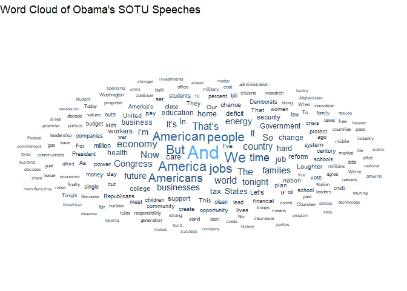

HW 07 - SOTU
================
Shirisha Biyyala
2024-11-20

## Load packages and data

``` r
library(tidytext)
```

    ## Warning: package 'tidytext' was built under R version 4.4.2

``` r
library(tidyverse)
library(ggwordcloud)
```

    ## Warning: package 'ggwordcloud' was built under R version 4.4.2

``` r
library(sotu)
library(textstem)
```

    ## Warning: package 'textstem' was built under R version 4.4.2

    ## Warning: package 'koRpus.lang.en' was built under R version 4.4.2

    ## Warning: package 'koRpus' was built under R version 4.4.2

    ## Warning: package 'sylly' was built under R version 4.4.2

``` r
view(sotu_meta)
glimpse(sotu_meta)
```

    ## Rows: 240
    ## Columns: 6
    ## $ X            <int> 1, 2, 3, 4, 5, 6, 7, 8, 9, 10, 11, 12, 13, 14, 15, 16, 17…
    ## $ president    <chr> "George Washington", "George Washington", "George Washing…
    ## $ year         <int> 1790, 1790, 1791, 1792, 1793, 1794, 1795, 1796, 1797, 179…
    ## $ years_active <chr> "1789-1793", "1789-1793", "1789-1793", "1789-1793", "1793…
    ## $ party        <chr> "Nonpartisan", "Nonpartisan", "Nonpartisan", "Nonpartisan…
    ## $ sotu_type    <chr> "speech", "speech", "speech", "speech", "speech", "speech…

``` r
view(sotu_text)
glimpse(sotu_text)
```

    ##  chr [1:240] "Fellow-Citizens of the Senate and House of Representatives: \n\nI embrace with great satisfaction the opportuni"| __truncated__ ...

## Exercises

### Merge Datasets

``` r
# Convert sotu_text to a dataframe
sotu_text_df <- tibble(speech = sotu_text)

# Merge the sotu_meta and sotu_text_df
sotu <- sotu_meta %>%
  add_column(speech = sotu_text_df$speech) %>%
  as_tibble() %>%
  rename(doc_id = X)

# Check the tibble
glimpse(sotu)
```

    ## Rows: 240
    ## Columns: 7
    ## $ doc_id       <int> 1, 2, 3, 4, 5, 6, 7, 8, 9, 10, 11, 12, 13, 14, 15, 16, 17…
    ## $ president    <chr> "George Washington", "George Washington", "George Washing…
    ## $ year         <int> 1790, 1790, 1791, 1792, 1793, 1794, 1795, 1796, 1797, 179…
    ## $ years_active <chr> "1789-1793", "1789-1793", "1789-1793", "1789-1793", "1793…
    ## $ party        <chr> "Nonpartisan", "Nonpartisan", "Nonpartisan", "Nonpartisan…
    ## $ sotu_type    <chr> "speech", "speech", "speech", "speech", "speech", "speech…
    ## $ speech       <chr> "Fellow-Citizens of the Senate and House of Representativ…

``` r
head(sotu)
```

    ## # A tibble: 6 × 7
    ##   doc_id president          year years_active party       sotu_type speech      
    ##    <int> <chr>             <int> <chr>        <chr>       <chr>     <chr>       
    ## 1      1 George Washington  1790 1789-1793    Nonpartisan speech    "Fellow-Cit…
    ## 2      2 George Washington  1790 1789-1793    Nonpartisan speech    "\n\n Fello…
    ## 3      3 George Washington  1791 1789-1793    Nonpartisan speech    "\n\n Fello…
    ## 4      4 George Washington  1792 1789-1793    Nonpartisan speech    "Fellow-Cit…
    ## 5      5 George Washington  1793 1793-1797    Nonpartisan speech    "\n\n Fello…
    ## 6      6 George Washington  1794 1793-1797    Nonpartisan speech    "\n\n Fello…

``` r
view(sotu)
```

## Exploratory Data Analysis

### Obama’s Speeches: Text Analysis

``` r
obama_n <- sotu %>%
  filter(president == "Barack Obama") %>%
  unnest_tokens(word, speech, to_lower = FALSE, strip_punct = FALSE) %>%
  count(word, sort = TRUE)

head(obama_n)
```

    ## # A tibble: 6 × 2
    ##   word      n
    ##   <chr> <int>
    ## 1 .      2978
    ## 2 ,      2866
    ## 3 the    2282
    ## 4 to     1815
    ## 5 and    1473
    ## 6 of     1311

``` r
obama_n_cleaned <- obama_n %>%
  anti_join(stop_words, by = "word") %>%
  filter(n >= 10, nchar(word) >= 2) %>%
  slice_max(n, n = 200)

head(obama_n)
```

    ## # A tibble: 6 × 2
    ##   word      n
    ##   <chr> <int>
    ## 1 .      2978
    ## 2 ,      2866
    ## 3 the    2282
    ## 4 to     1815
    ## 5 and    1473
    ## 6 of     1311

#### Word Cloud for Obama’s Speeches

``` r
ggplot(obama_n_cleaned) +
  geom_text_wordcloud(aes(label = word, size = n, color = n), rm_outside = TRUE) +
  scale_size_area(max_size = 8) +
  theme_void() +
  labs(title = "Word Cloud of Obama's SOTU Speeches")
```

<!-- -->
