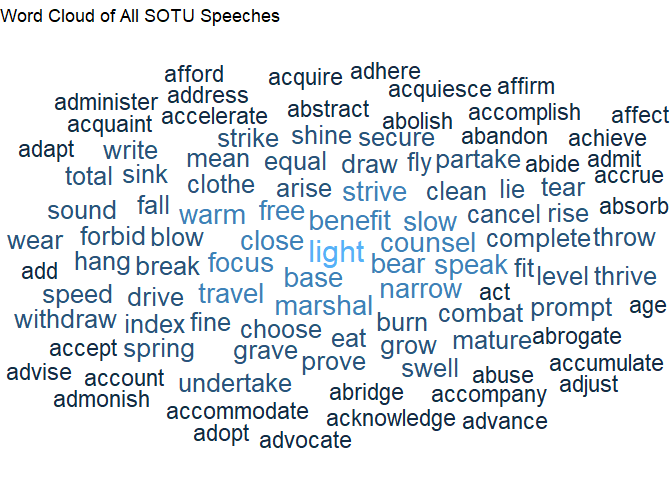
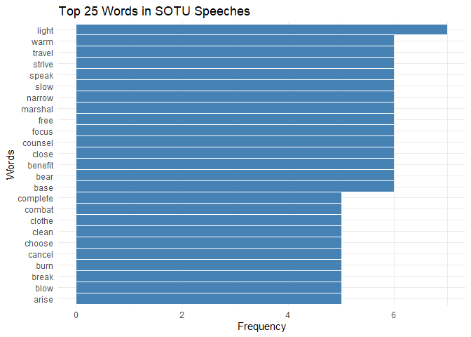
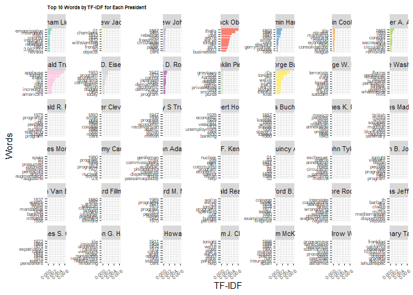

HW 07 - SOTU
================
Shirisha Biyyala
2024-11-20

## Load packages and data

``` r
library(tidytext)
library(tidyverse)
library(ggwordcloud)
library(sotu)
library(textstem)
```

``` r
view(sotu_meta)
glimpse(sotu_meta)
```

    ## Rows: 240
    ## Columns: 6
    ## $ X            <int> 1, 2, 3, 4, 5, 6, 7, 8, 9, 10, 11, 12, 13, 14, 15, 16, 17…
    ## $ president    <chr> "George Washington", "George Washington", "George Washing…
    ## $ year         <int> 1790, 1790, 1791, 1792, 1793, 1794, 1795, 1796, 1797, 179…
    ## $ years_active <chr> "1789-1793", "1789-1793", "1789-1793", "1789-1793", "1793…
    ## $ party        <chr> "Nonpartisan", "Nonpartisan", "Nonpartisan", "Nonpartisan…
    ## $ sotu_type    <chr> "speech", "speech", "speech", "speech", "speech", "speech…

``` r
view(sotu_text)
glimpse(sotu_text)
```

    ##  chr [1:240] "Fellow-Citizens of the Senate and House of Representatives: \n\nI embrace with great satisfaction the opportuni"| __truncated__ ...

## Exercises

### Merge Datasets

``` r
# Convert sotu_text to a dataframe
sotu_text_df <- tibble(speech = sotu_text)

# Merge the sotu_meta and sotu_text_df
sotu <- sotu_meta %>%
  add_column(speech = sotu_text_df$speech) %>%
  as_tibble() %>%
  rename(doc_id = X)

# Check the tibble
glimpse(sotu)
```

    ## Rows: 240
    ## Columns: 7
    ## $ doc_id       <int> 1, 2, 3, 4, 5, 6, 7, 8, 9, 10, 11, 12, 13, 14, 15, 16, 17…
    ## $ president    <chr> "George Washington", "George Washington", "George Washing…
    ## $ year         <int> 1790, 1790, 1791, 1792, 1793, 1794, 1795, 1796, 1797, 179…
    ## $ years_active <chr> "1789-1793", "1789-1793", "1789-1793", "1789-1793", "1793…
    ## $ party        <chr> "Nonpartisan", "Nonpartisan", "Nonpartisan", "Nonpartisan…
    ## $ sotu_type    <chr> "speech", "speech", "speech", "speech", "speech", "speech…
    ## $ speech       <chr> "Fellow-Citizens of the Senate and House of Representativ…

``` r
head(sotu)
```

    ## # A tibble: 6 × 7
    ##   doc_id president          year years_active party       sotu_type speech      
    ##    <int> <chr>             <int> <chr>        <chr>       <chr>     <chr>       
    ## 1      1 George Washington  1790 1789-1793    Nonpartisan speech    "Fellow-Cit…
    ## 2      2 George Washington  1790 1789-1793    Nonpartisan speech    "\n\n Fello…
    ## 3      3 George Washington  1791 1789-1793    Nonpartisan speech    "\n\n Fello…
    ## 4      4 George Washington  1792 1789-1793    Nonpartisan speech    "Fellow-Cit…
    ## 5      5 George Washington  1793 1793-1797    Nonpartisan speech    "\n\n Fello…
    ## 6      6 George Washington  1794 1793-1797    Nonpartisan speech    "\n\n Fello…

``` r
view(sotu)
```

## Exploratory Data Analysis

### Obama’s Speeches: Text Analysis

``` r
obama_n <- sotu %>%
  filter(president == "Barack Obama") %>%
  unnest_tokens(word, speech, to_lower = FALSE, strip_punct = FALSE) %>%
  count(word, sort = TRUE)

head(obama_n)
```

    ## # A tibble: 6 × 2
    ##   word      n
    ##   <chr> <int>
    ## 1 .      2978
    ## 2 ,      2866
    ## 3 the    2282
    ## 4 to     1815
    ## 5 and    1473
    ## 6 of     1311

``` r
obama_n_cleaned <- obama_n %>%
  anti_join(stop_words, by = "word") %>%
  filter(n >= 10, nchar(word) >= 2) %>%
  slice_max(n, n = 200)

head(obama_n)
```

    ## # A tibble: 6 × 2
    ##   word      n
    ##   <chr> <int>
    ## 1 .      2978
    ## 2 ,      2866
    ## 3 the    2282
    ## 4 to     1815
    ## 5 and    1473
    ## 6 of     1311

#### Word Cloud for Obama’s Speeches

``` r
ggplot(obama_n_cleaned) +
  geom_text_wordcloud(aes(label = word, size = n, color = n), rm_outside = TRUE) +
  scale_size_area(max_size = 8) +
  theme_void() +
  labs(title = "Word Cloud of Obama's SOTU Speeches")
```

<!-- -->

## From Obama to everyone

``` r
sotu_corpus <- sotu %>%
  unnest_tokens(word, speech) %>%
  count(word, sort = TRUE)

head(sotu_corpus)
```

    ## # A tibble: 6 × 2
    ##   word       n
    ##   <chr>  <int>
    ## 1 the   165603
    ## 2 of    106402
    ## 3 and    68063
    ## 4 to     68039
    ## 5 in     43429
    ## 6 a      31342

``` r
top_words <- sotu_corpus %>%
  anti_join(stop_words, by = "word") %>%
  slice_max(n, n = 10)
print(top_words)
```

    ## # A tibble: 10 × 2
    ##    word           n
    ##    <chr>      <int>
    ##  1 government  7597
    ##  2 congress    5808
    ##  3 united      5156
    ##  4 people      4298
    ##  5 country     3641
    ##  6 public      3419
    ##  7 time        3188
    ##  8 american    2988
    ##  9 war         2976
    ## 10 world       2633

``` r
sotu_corpus <- sotu_corpus %>%
  mutate(lemmata = lemmatize_words(word))

head(sotu_corpus)
```

    ## # A tibble: 6 × 3
    ##   word       n lemmata
    ##   <chr>  <int> <chr>  
    ## 1 the   165603 the    
    ## 2 of    106402 of     
    ## 3 and    68063 and    
    ## 4 to     68039 to     
    ## 5 in     43429 in     
    ## 6 a      31342 a

``` r
sotu_top_words <- sotu_corpus %>%
  count(lemmata, sort = TRUE) %>%
  slice_max(n, n = 100)

sotu_top_words
```

    ## # A tibble: 1,093 × 2
    ##    lemmata     n
    ##    <chr>   <int>
    ##  1 be          9
    ##  2 light       7
    ##  3 base        6
    ##  4 bear        6
    ##  5 benefit     6
    ##  6 close       6
    ##  7 counsel     6
    ##  8 focus       6
    ##  9 free        6
    ## 10 have        6
    ## # ℹ 1,083 more rows

## Analyzing and visualizing texts

``` r
ggplot(sotu_top_words) +
  geom_text_wordcloud(aes(label = lemmata, size = n, color = n), rm_outside = TRUE) +
  scale_size_area(max_size = 8) +
  theme_void() +
  labs(title = "Word Cloud of All SOTU Speeches")
```

    ## Warning in wordcloud_boxes(data_points = points_valid_first, boxes = boxes, :
    ## Some words could not fit on page. They have been removed.

<!-- -->

``` r
sotu_top_25 <- sotu_top_words %>%
  slice_max(n, n = 25)

ggplot(sotu_top_25, aes(x = reorder(lemmata, n), y = n)) +
  geom_col(fill = "steelblue") +
  coord_flip() +
  labs(
    title = "Top 25 Words in SOTU Speeches",
    x = "Words",
    y = "Frequency"
  ) +
  theme_minimal()
```

<!-- -->

``` r
# Create the bar plot with adjustments to avoid overlapping labels
ggplot(sotu_top_25, aes(x = reorder(lemmata, n), y = n)) +
  geom_col(fill = "steelblue") +
  coord_flip() +
  labs(
    title = "Top 25 Words in SOTU Speeches",
    x = "Words",
    y = "Frequency"
  ) +
  theme_minimal() +
  theme(
    axis.text.y = element_text(angle = 45, hjust = 1, size = 10),  # Rotate and reduce text size
    plot.margin = margin(1, 1, 1, 3, "cm")  # Increase left margin
  ) +
  scale_y_discrete(expand = expansion(mult = c(0.1, 0.1)))  # Adjust y-axis spacing
```

<!-- -->

``` r
sotu_tfidf <- sotu %>%
  unnest_tokens(word, speech) %>%
  count(president, word, sort = TRUE) %>%
  bind_tf_idf(word, president, n)
```

``` r
top_tfidf <- sotu_tfidf %>%
  group_by(president) %>%
  slice_max(tf_idf, n = 10) %>%
  ungroup()

ggplot(top_tfidf, aes(x = reorder_within(word, tf_idf, president), y = tf_idf, fill = president)) +
  geom_col(show.legend = FALSE) +
  facet_wrap(~ president, scales = "free_y") +
  coord_flip() +
  scale_x_reordered() +
  labs(
    title = "Top 10 Words by TF-IDF for Each President",
    x = "Words",
    y = "TF-IDF"
  ) +
  theme_minimal()
```

<!-- -->
