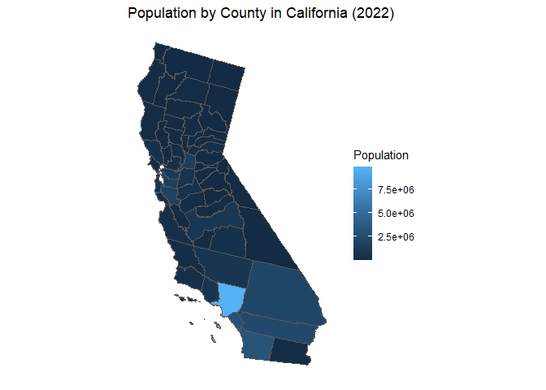

hw08 - Maps
================
Shirisha Biyyala
2024-11-27

## Load packages

``` r
library(tidycensus)
library(dplyr)
library(tigris)
library(ggplot2)
library(sf)
```

## Set up and verify API Key

``` r
# census_api_key("YOUR_API_KEY_removed", install = TRUE)

test_data <- get_acs(geography = "state", variables = "B01003_001", year = 2022)
```

    ## Getting data from the 2018-2022 5-year ACS

``` r
head(test_data)
```

    ## # A tibble: 6 × 5
    ##   GEOID NAME       variable   estimate   moe
    ##   <chr> <chr>      <chr>         <dbl> <dbl>
    ## 1 01    Alabama    B01003_001  5028092    NA
    ## 2 02    Alaska     B01003_001   734821    NA
    ## 3 04    Arizona    B01003_001  7172282    NA
    ## 4 05    Arkansas   B01003_001  3018669    NA
    ## 5 06    California B01003_001 39356104    NA
    ## 6 08    Colorado   B01003_001  5770790    NA

API key has been setup and the data preview indicates that the API is
working correctly.

## Load variables

``` r
# Load the list of variables 
variables <- load_variables(year = 2022, dataset = "acs1")

# Preview the variables
head(variables)
```

    ## # A tibble: 6 × 3
    ##   name        label                                   concept                 
    ##   <chr>       <chr>                                   <chr>                   
    ## 1 B01001A_001 Estimate!!Total:                        Sex by Age (White Alone)
    ## 2 B01001A_002 Estimate!!Total:!!Male:                 Sex by Age (White Alone)
    ## 3 B01001A_003 Estimate!!Total:!!Male:!!Under 5 years  Sex by Age (White Alone)
    ## 4 B01001A_004 Estimate!!Total:!!Male:!!5 to 9 years   Sex by Age (White Alone)
    ## 5 B01001A_005 Estimate!!Total:!!Male:!!10 to 14 years Sex by Age (White Alone)
    ## 6 B01001A_006 Estimate!!Total:!!Male:!!15 to 17 years Sex by Age (White Alone)

### Part 1: State-Level Data and Mapping

#### Step 1: Load State-Level Data

``` r
# Download state-level population data
state_data <- get_acs(geography = "state", variables = "B01003_001", year = 2022, survey = "acs1")
```

    ## Getting data from the 2022 1-year ACS

    ## The 1-year ACS provides data for geographies with populations of 65,000 and greater.

``` r
# Preview the data
head(state_data)
```

    ## # A tibble: 6 × 5
    ##   GEOID NAME       variable   estimate   moe
    ##   <chr> <chr>      <chr>         <dbl> <dbl>
    ## 1 01    Alabama    B01003_001  5074296    NA
    ## 2 02    Alaska     B01003_001   733583    NA
    ## 3 04    Arizona    B01003_001  7359197    NA
    ## 4 05    Arkansas   B01003_001  3045637    NA
    ## 5 06    California B01003_001 39029342    NA
    ## 6 08    Colorado   B01003_001  5839926    NA

#### Step 2: Download US State Shapefiles

``` r
# Download state shapefiles
state_shapes <- states(cb = TRUE)
```

    ## Retrieving data for the year 2021

    ##   |                                                                              |                                                                      |   0%  |                                                                              |=                                                                     |   1%  |                                                                              |=                                                                     |   2%  |                                                                              |==                                                                    |   2%  |                                                                              |==                                                                    |   3%  |                                                                              |===                                                                   |   4%  |                                                                              |===                                                                   |   5%  |                                                                              |====                                                                  |   6%  |                                                                              |=====                                                                 |   7%  |                                                                              |=====                                                                 |   8%  |                                                                              |======                                                                |   8%  |                                                                              |======                                                                |   9%  |                                                                              |=======                                                               |  10%  |                                                                              |========                                                              |  11%  |                                                                              |========                                                              |  12%  |                                                                              |=========                                                             |  12%  |                                                                              |=========                                                             |  13%  |                                                                              |==========                                                            |  14%  |                                                                              |==========                                                            |  15%  |                                                                              |===========                                                           |  15%  |                                                                              |===========                                                           |  16%  |                                                                              |============                                                          |  17%  |                                                                              |=============                                                         |  18%  |                                                                              |=============                                                         |  19%  |                                                                              |==============                                                        |  19%  |                                                                              |==============                                                        |  20%  |                                                                              |===============                                                       |  21%  |                                                                              |===============                                                       |  22%  |                                                                              |================                                                      |  23%  |                                                                              |=================                                                     |  24%  |                                                                              |=================                                                     |  25%  |                                                                              |==================                                                    |  25%  |                                                                              |==================                                                    |  26%  |                                                                              |===================                                                   |  27%  |                                                                              |====================                                                  |  28%  |                                                                              |====================                                                  |  29%  |                                                                              |======================                                                |  31%  |                                                                              |======================                                                |  32%  |                                                                              |=======================                                               |  32%  |                                                                              |=======================                                               |  33%  |                                                                              |========================                                              |  34%  |                                                                              |========================                                              |  35%  |                                                                              |=========================                                             |  35%  |                                                                              |=========================                                             |  36%  |                                                                              |==========================                                            |  37%  |                                                                              |===========================                                           |  38%  |                                                                              |===========================                                           |  39%  |                                                                              |=============================                                         |  42%  |                                                                              |==============================                                        |  42%  |                                                                              |==============================                                        |  43%  |                                                                              |===============================                                       |  44%  |                                                                              |=================================                                     |  48%  |                                                                              |==================================                                    |  48%  |                                                                              |==================================                                    |  49%  |                                                                              |===================================                                   |  49%  |                                                                              |===================================                                   |  50%  |                                                                              |=======================================                               |  56%  |                                                                              |========================================                              |  57%  |                                                                              |=========================================                             |  58%  |                                                                              |=========================================                             |  59%  |                                                                              |==========================================                            |  59%  |                                                                              |============================================                          |  63%  |                                                                              |=============================================                         |  64%  |                                                                              |=============================================                         |  65%  |                                                                              |==============================================                        |  65%  |                                                                              |==============================================                        |  66%  |                                                                              |===============================================                       |  67%  |                                                                              |===============================================                       |  68%  |                                                                              |================================================                      |  68%  |                                                                              |================================================                      |  69%  |                                                                              |=================================================                     |  70%  |                                                                              |=================================================                     |  71%  |                                                                              |==================================================                    |  71%  |                                                                              |==================================================                    |  72%  |                                                                              |====================================================                  |  74%  |                                                                              |====================================================                  |  75%  |                                                                              |=====================================================                 |  75%  |                                                                              |=====================================================                 |  76%  |                                                                              |=======================================================               |  79%  |                                                                              |========================================================              |  80%  |                                                                              |=========================================================             |  81%  |                                                                              |=========================================================             |  82%  |                                                                              |==========================================================            |  82%  |                                                                              |==========================================================            |  83%  |                                                                              |===========================================================           |  84%  |                                                                              |============================================================          |  85%  |                                                                              |============================================================          |  86%  |                                                                              |=============================================================         |  86%  |                                                                              |=============================================================         |  87%  |                                                                              |=============================================================         |  88%  |                                                                              |==============================================================        |  88%  |                                                                              |==============================================================        |  89%  |                                                                              |===============================================================       |  89%  |                                                                              |===============================================================       |  90%  |                                                                              |================================================================      |  91%  |                                                                              |================================================================      |  92%  |                                                                              |=================================================================     |  93%  |                                                                              |======================================================================| 100%

#### Step 3: Merge Data Using State Names

``` r
# Convert state names to lowercase for consistency
state_data <- state_data %>%
  mutate(NAME = tolower(NAME))
state_shapes <- state_shapes %>%
  mutate(NAME = tolower(NAME))

# Merge the data using state names
state_map_data <- left_join(state_shapes, state_data, by = "NAME")

# Check the merged data
head(state_map_data)
```

    ## Simple feature collection with 6 features and 13 fields
    ## Geometry type: MULTIPOLYGON
    ## Dimension:     XY
    ## Bounding box:  xmin: -179.1489 ymin: -14.5487 xmax: 179.7785 ymax: 71.36516
    ## Geodetic CRS:  NAD83
    ##   STATEFP  STATENS    AFFGEOID GEOID.x STUSPS           NAME LSAD        ALAND
    ## 1      56 01779807 0400000US56      56     WY        wyoming   00 2.514587e+11
    ## 2      02 01785533 0400000US02      02     AK         alaska   00 1.478943e+12
    ## 3      24 01714934 0400000US24      24     MD       maryland   00 2.515199e+10
    ## 4      60 01802701 0400000US60      60     AS american samoa   00 1.977591e+08
    ## 5      05 00068085 0400000US05      05     AR       arkansas   00 1.346608e+11
    ## 6      38 01779797 0400000US38      38     ND   north dakota   00 1.786943e+11
    ##         AWATER GEOID.y   variable estimate moe                       geometry
    ## 1   1867503716      56 B01003_001   581381  NA MULTIPOLYGON (((-111.0546 4...
    ## 2 245378425142      02 B01003_001   733583  NA MULTIPOLYGON (((179.4825 51...
    ## 3   6979074857      24 B01003_001  6164660  NA MULTIPOLYGON (((-76.05015 3...
    ## 4   1307243751    <NA>       <NA>       NA  NA MULTIPOLYGON (((-168.1458 -...
    ## 5   3121950081      05 B01003_001  3045637  NA MULTIPOLYGON (((-94.61792 3...
    ## 6   4414779956      38 B01003_001   779261  NA MULTIPOLYGON (((-104.0487 4...

#### Step 4: Plot the US Map

``` r
glimpse(state_map_data)
```

    ## Rows: 56
    ## Columns: 14
    ## $ STATEFP  <chr> "56", "02", "24", "60", "05", "38", "10", "66", "35", "49", "…
    ## $ STATENS  <chr> "01779807", "01785533", "01714934", "01802701", "00068085", "…
    ## $ AFFGEOID <chr> "0400000US56", "0400000US02", "0400000US24", "0400000US60", "…
    ## $ GEOID.x  <chr> "56", "02", "24", "60", "05", "38", "10", "66", "35", "49", "…
    ## $ STUSPS   <chr> "WY", "AK", "MD", "AS", "AR", "ND", "DE", "GU", "NM", "UT", "…
    ## $ NAME     <chr> "wyoming", "alaska", "maryland", "american samoa", "arkansas"…
    ## $ LSAD     <chr> "00", "00", "00", "00", "00", "00", "00", "00", "00", "00", "…
    ## $ ALAND    <dbl> 2.514587e+11, 1.478943e+12, 2.515199e+10, 1.977591e+08, 1.346…
    ## $ AWATER   <dbl> 1867503716, 245378425142, 6979074857, 1307243751, 3121950081,…
    ## $ GEOID.y  <chr> "56", "02", "24", NA, "05", "38", "10", NA, "35", "49", "54",…
    ## $ variable <chr> "B01003_001", "B01003_001", "B01003_001", NA, "B01003_001", "…
    ## $ estimate <dbl> 581381, 733583, 6164660, NA, 3045637, 779261, 1018396, NA, 21…
    ## $ moe      <dbl> NA, NA, NA, NA, NA, NA, NA, NA, NA, NA, NA, NA, NA, NA, NA, N…
    ## $ geometry <MULTIPOLYGON [°]> MULTIPOLYGON (((-111.0546 4..., MULTIPOLYGON (((…

##### Step 4.1: Your first map

``` r
# Create the map
state_map_data %>%
  ggplot(aes(fill = estimate)) +
    geom_sf()  +
    coord_sf(crs = st_crs(5070))  +
    labs(title = "Population by State (2022)", fill = "Population") +
    theme_minimal()
```

<!-- -->

##### Step 4.2: Filter Data by Geographical Bounds

``` r
# Filter for contiguous states using latitude and longitude bounds
states_clean <- state_map_data %>%
  filter(!NAME %in% c("alaska", "american samoa", "hawaii", "guam", "puerto rico", 
                      "commonwealth of the northern mariana islands", 
                      "united states virgin islands"))
```

##### Step 4.3: Change projection

``` r
# Change projection to Albers Equal Area
state_map <- ggplot(states_clean) +
  geom_sf(aes(fill = estimate)) +
  coord_sf(crs = st_crs(5070)) +
  labs(title = "Population by Contiguous U.S. States (2022)", fill = "Population") +
  theme_minimal()

state_map
```

<!-- -->

##### Step 4.4: Remove axes and grid

``` r
# Final map without axes and gridlines
ggplot(states_clean) +
  geom_sf(aes(fill = estimate)) +
  labs(title = "Population by State (2022)", fill = "Population") +
  coord_sf(crs = st_crs(5070)) +  # Apply projection
  theme_minimal() +
  theme(
    axis.title = element_blank(),
    axis.text = element_blank(),
    axis.ticks = element_blank(),
    panel.grid = element_blank()
  )
```

<!-- -->

### Part 2: County-Level Data and Mapping for a Specific State

#### Step 1: Load County-Level Data

``` r
# Create the map
# Download county-level population data for California
county_data <- get_acs(geography = "county", variables = "B01003_001", state = "CA", year = 2022)
```

    ## Getting data from the 2018-2022 5-year ACS

``` r
# Preview the data
head(county_data)
```

    ## # A tibble: 6 × 5
    ##   GEOID NAME                         variable   estimate   moe
    ##   <chr> <chr>                        <chr>         <dbl> <dbl>
    ## 1 06001 Alameda County, California   B01003_001  1663823    NA
    ## 2 06003 Alpine County, California    B01003_001     1515   206
    ## 3 06005 Amador County, California    B01003_001    40577    NA
    ## 4 06007 Butte County, California     B01003_001   213605    NA
    ## 5 06009 Calaveras County, California B01003_001    45674    NA
    ## 6 06011 Colusa County, California    B01003_001    21811    NA

#### Step 2: Download County Shapefiles

``` r
# Download county shape files for California
county_shapes <- counties(state = "CA", cb = TRUE)
```

    ## Retrieving data for the year 2022

    ##   |                                                                              |                                                                      |   0%  |                                                                              |=                                                                     |   1%  |                                                                              |=                                                                     |   2%  |                                                                              |==                                                                    |   2%  |                                                                              |==                                                                    |   3%  |                                                                              |===                                                                   |   4%  |                                                                              |===                                                                   |   5%  |                                                                              |====                                                                  |   5%  |                                                                              |====                                                                  |   6%  |                                                                              |=====                                                                 |   6%  |                                                                              |=====                                                                 |   7%  |                                                                              |======                                                                |   9%  |                                                                              |=======                                                               |   9%  |                                                                              |=======                                                               |  10%  |                                                                              |=======                                                               |  11%  |                                                                              |========                                                              |  11%  |                                                                              |========                                                              |  12%  |                                                                              |=========                                                             |  12%  |                                                                              |=========                                                             |  13%  |                                                                              |==========                                                            |  14%  |                                                                              |==========                                                            |  15%  |                                                                              |===========                                                           |  15%  |                                                                              |===========                                                           |  16%  |                                                                              |============                                                          |  17%  |                                                                              |============                                                          |  18%  |                                                                              |=============                                                         |  18%  |                                                                              |=============                                                         |  19%  |                                                                              |==============                                                        |  19%  |                                                                              |==============                                                        |  20%  |                                                                              |==============                                                        |  21%  |                                                                              |===============                                                       |  21%  |                                                                              |===============                                                       |  22%  |                                                                              |================                                                      |  22%  |                                                                              |================                                                      |  23%  |                                                                              |================                                                      |  24%  |                                                                              |=================                                                     |  24%  |                                                                              |=================                                                     |  25%  |                                                                              |==================                                                    |  25%  |                                                                              |==================                                                    |  26%  |                                                                              |===================                                                   |  26%  |                                                                              |===================                                                   |  27%  |                                                                              |===================                                                   |  28%  |                                                                              |====================                                                  |  28%  |                                                                              |====================                                                  |  29%  |                                                                              |=====================                                                 |  29%  |                                                                              |=====================                                                 |  30%  |                                                                              |=====================                                                 |  31%  |                                                                              |======================                                                |  31%  |                                                                              |======================                                                |  32%  |                                                                              |=======================                                               |  32%  |                                                                              |=======================                                               |  33%  |                                                                              |=======================                                               |  34%  |                                                                              |========================                                              |  34%  |                                                                              |========================                                              |  35%  |                                                                              |=========================                                             |  35%  |                                                                              |=========================                                             |  36%  |                                                                              |==========================                                            |  37%  |                                                                              |==========================                                            |  38%  |                                                                              |===========================                                           |  38%  |                                                                              |===========================                                           |  39%  |                                                                              |============================                                          |  39%  |                                                                              |============================                                          |  40%  |                                                                              |============================                                          |  41%  |                                                                              |=============================                                         |  41%  |                                                                              |=============================                                         |  42%  |                                                                              |==============================                                        |  42%  |                                                                              |==============================                                        |  43%  |                                                                              |===============================                                       |  44%  |                                                                              |===============================                                       |  45%  |                                                                              |================================                                      |  45%  |                                                                              |================================                                      |  46%  |                                                                              |=================================                                     |  46%  |                                                                              |=================================                                     |  47%  |                                                                              |=================================                                     |  48%  |                                                                              |==================================                                    |  48%  |                                                                              |==================================                                    |  49%  |                                                                              |===================================                                   |  49%  |                                                                              |===================================                                   |  50%  |                                                                              |====================================                                  |  51%  |                                                                              |====================================                                  |  52%  |                                                                              |=====================================                                 |  52%  |                                                                              |=====================================                                 |  53%  |                                                                              |=====================================                                 |  54%  |                                                                              |======================================                                |  54%  |                                                                              |======================================                                |  55%  |                                                                              |=======================================                               |  55%  |                                                                              |=======================================                               |  56%  |                                                                              |========================================                              |  57%  |                                                                              |=========================================                             |  58%  |                                                                              |=========================================                             |  59%  |                                                                              |==========================================                            |  59%  |                                                                              |==========================================                            |  60%  |                                                                              |==========================================                            |  61%  |                                                                              |===========================================                           |  61%  |                                                                              |===========================================                           |  62%  |                                                                              |============================================                          |  62%  |                                                                              |============================================                          |  63%  |                                                                              |============================================                          |  64%  |                                                                              |=============================================                         |  64%  |                                                                              |=============================================                         |  65%  |                                                                              |==============================================                        |  65%  |                                                                              |==============================================                        |  66%  |                                                                              |===============================================                       |  67%  |                                                                              |===============================================                       |  68%  |                                                                              |================================================                      |  68%  |                                                                              |================================================                      |  69%  |                                                                              |=================================================                     |  69%  |                                                                              |=================================================                     |  70%  |                                                                              |=================================================                     |  71%  |                                                                              |==================================================                    |  71%  |                                                                              |==================================================                    |  72%  |                                                                              |===================================================                   |  72%  |                                                                              |===================================================                   |  73%  |                                                                              |====================================================                  |  74%  |                                                                              |====================================================                  |  75%  |                                                                              |=====================================================                 |  75%  |                                                                              |=====================================================                 |  76%  |                                                                              |======================================================                |  77%  |                                                                              |======================================================                |  78%  |                                                                              |=======================================================               |  78%  |                                                                              |=======================================================               |  79%  |                                                                              |========================================================              |  79%  |                                                                              |========================================================              |  80%  |                                                                              |========================================================              |  81%  |                                                                              |=========================================================             |  81%  |                                                                              |=========================================================             |  82%  |                                                                              |==========================================================            |  82%  |                                                                              |==========================================================            |  83%  |                                                                              |===========================================================           |  84%  |                                                                              |===========================================================           |  85%  |                                                                              |============================================================          |  85%  |                                                                              |============================================================          |  86%  |                                                                              |=============================================================         |  87%  |                                                                              |=============================================================         |  88%  |                                                                              |==============================================================        |  88%  |                                                                              |==============================================================        |  89%  |                                                                              |===============================================================       |  89%  |                                                                              |===============================================================       |  90%  |                                                                              |===============================================================       |  91%  |                                                                              |================================================================      |  91%  |                                                                              |================================================================      |  92%  |                                                                              |=================================================================     |  92%  |                                                                              |=================================================================     |  93%  |                                                                              |==================================================================    |  94%  |                                                                              |==================================================================    |  95%  |                                                                              |===================================================================   |  95%  |                                                                              |===================================================================   |  96%  |                                                                              |====================================================================  |  96%  |                                                                              |====================================================================  |  97%  |                                                                              |====================================================================  |  98%  |                                                                              |===================================================================== |  98%  |                                                                              |===================================================================== |  99%  |                                                                              |======================================================================|  99%  |                                                                              |======================================================================| 100%

``` r
head(county_shapes)
```

    ## Simple feature collection with 6 features and 12 fields
    ## Geometry type: MULTIPOLYGON
    ## Dimension:     XY
    ## Bounding box:  xmin: -124.256 ymin: 32.80146 xmax: -117.6464 ymax: 42.00076
    ## Geodetic CRS:  NAD83
    ##    STATEFP COUNTYFP COUNTYNS       AFFGEOID GEOID        NAME
    ## 10      06      037 00277283 0500000US06037 06037 Los Angeles
    ## 11      06      097 01657246 0500000US06097 06097      Sonoma
    ## 12      06      001 01675839 0500000US06001 06001     Alameda
    ## 13      06      045 00277287 0500000US06045 06045   Mendocino
    ## 14      06      015 01682074 0500000US06015 06015   Del Norte
    ## 18      06      055 00277292 0500000US06055 06055        Napa
    ##              NAMELSAD STUSPS STATE_NAME LSAD       ALAND     AWATER
    ## 10 Los Angeles County     CA California   06 10515988166 1785003207
    ## 11      Sonoma County     CA California   06  4080091725  497303747
    ## 12     Alameda County     CA California   06  1910010507  216909647
    ## 13   Mendocino County     CA California   06  9082586851  961786019
    ## 14   Del Norte County     CA California   06  2606049835  578810831
    ## 18        Napa County     CA California   06  1947606240  104444864
    ##                          geometry
    ## 10 MULTIPOLYGON (((-118.6044 3...
    ## 11 MULTIPOLYGON (((-123.5335 3...
    ## 12 MULTIPOLYGON (((-122.3423 3...
    ## 13 MULTIPOLYGON (((-124.0233 4...
    ## 14 MULTIPOLYGON (((-124.2175 4...
    ## 18 MULTIPOLYGON (((-122.6466 3...

``` r
# Check the names in both datasets
head(county_data$NAME)
```

    ## [1] "Alameda County, California"   "Alpine County, California"   
    ## [3] "Amador County, California"    "Butte County, California"    
    ## [5] "Calaveras County, California" "Colusa County, California"

``` r
head(county_shapes$NAME)
```

    ## [1] "Los Angeles" "Sonoma"      "Alameda"     "Mendocino"   "Del Norte"  
    ## [6] "Napa"

``` r
# Clean the 'NAME' column in county_shapes by removing ' County, California' and convert to lowercase
county_shapes$NAME <- tolower(gsub(" County, California", "", county_shapes$NAME))

# Check if cleaning has worked
head(county_shapes$NAME)
```

    ## [1] "los angeles" "sonoma"      "alameda"     "mendocino"   "del norte"  
    ## [6] "napa"

``` r
# Clean the 'NAME' column in county_data by removing ' county, california' and convert to lowercase
county_data$NAME <- tolower(gsub(" county, california", "", county_data$NAME))

# Check if cleaning has worked
head(county_data$NAME)
```

    ## [1] "alameda county, california"   "alpine county, california"   
    ## [3] "amador county, california"    "butte county, california"    
    ## [5] "calaveras county, california" "colusa county, california"

#### Step 3: Merge Data Using County Names

``` r
# Merge the data by county name
county_map_data <- left_join(county_shapes, county_data, by = "NAME")

# Check the merged data
head(county_map_data)
```

    ## Simple feature collection with 6 features and 16 fields
    ## Geometry type: MULTIPOLYGON
    ## Dimension:     XY
    ## Bounding box:  xmin: -124.256 ymin: 32.80146 xmax: -117.6464 ymax: 42.00076
    ## Geodetic CRS:  NAD83
    ##   STATEFP COUNTYFP COUNTYNS       AFFGEOID GEOID.x        NAME
    ## 1      06      037 00277283 0500000US06037   06037 los angeles
    ## 2      06      097 01657246 0500000US06097   06097      sonoma
    ## 3      06      001 01675839 0500000US06001   06001     alameda
    ## 4      06      045 00277287 0500000US06045   06045   mendocino
    ## 5      06      015 01682074 0500000US06015   06015   del norte
    ## 6      06      055 00277292 0500000US06055   06055        napa
    ##             NAMELSAD STUSPS STATE_NAME LSAD       ALAND     AWATER GEOID.y
    ## 1 Los Angeles County     CA California   06 10515988166 1785003207    <NA>
    ## 2      Sonoma County     CA California   06  4080091725  497303747    <NA>
    ## 3     Alameda County     CA California   06  1910010507  216909647    <NA>
    ## 4   Mendocino County     CA California   06  9082586851  961786019    <NA>
    ## 5   Del Norte County     CA California   06  2606049835  578810831    <NA>
    ## 6        Napa County     CA California   06  1947606240  104444864    <NA>
    ##   variable estimate moe                       geometry
    ## 1     <NA>       NA  NA MULTIPOLYGON (((-118.6044 3...
    ## 2     <NA>       NA  NA MULTIPOLYGON (((-123.5335 3...
    ## 3     <NA>       NA  NA MULTIPOLYGON (((-122.3423 3...
    ## 4     <NA>       NA  NA MULTIPOLYGON (((-124.0233 4...
    ## 5     <NA>       NA  NA MULTIPOLYGON (((-124.2175 4...
    ## 6     <NA>       NA  NA MULTIPOLYGON (((-122.6466 3...

#### Step 4: Plot the County Map

``` r
# Create the map with county-level population data
ggplot(county_map_data) +
  geom_sf(aes(fill = estimate)) +
  labs(title = "Population by County in California (2022)", fill = "Population") +
  coord_sf(crs = st_crs(5070)) +  # Apply projection
  theme_minimal() +
  theme(
    axis.title = element_blank(),
    axis.text = element_blank(),
    axis.ticks = element_blank(),
    panel.grid = element_blank()
  )
```

<!-- -->
