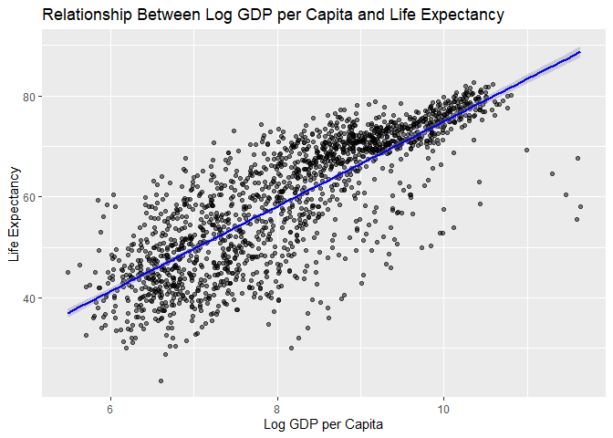

hw09
================
Shirisha Biyyala
2024-12-04

## Linear Models and Fixed Effects in R

### Prerequisites

``` r
library(gapminder)
library(tidyverse)
library(broom)
library(lfe)
library(parsnip)
```

### Step 1: Explore the Data

``` r
# Load data
data("gapminder")

# View structure and summary
glimpse(gapminder)
```

    ## Rows: 1,704
    ## Columns: 6
    ## $ country   <fct> "Afghanistan", "Afghanistan", "Afghanistan", "Afghanistan", …
    ## $ continent <fct> Asia, Asia, Asia, Asia, Asia, Asia, Asia, Asia, Asia, Asia, …
    ## $ year      <int> 1952, 1957, 1962, 1967, 1972, 1977, 1982, 1987, 1992, 1997, …
    ## $ lifeExp   <dbl> 28.801, 30.332, 31.997, 34.020, 36.088, 38.438, 39.854, 40.8…
    ## $ pop       <int> 8425333, 9240934, 10267083, 11537966, 13079460, 14880372, 12…
    ## $ gdpPercap <dbl> 779.4453, 820.8530, 853.1007, 836.1971, 739.9811, 786.1134, …

``` r
summary(gapminder)
```

    ##         country        continent        year         lifeExp     
    ##  Afghanistan:  12   Africa  :624   Min.   :1952   Min.   :23.60  
    ##  Albania    :  12   Americas:300   1st Qu.:1966   1st Qu.:48.20  
    ##  Algeria    :  12   Asia    :396   Median :1980   Median :60.71  
    ##  Angola     :  12   Europe  :360   Mean   :1980   Mean   :59.47  
    ##  Argentina  :  12   Oceania : 24   3rd Qu.:1993   3rd Qu.:70.85  
    ##  Australia  :  12                  Max.   :2007   Max.   :82.60  
    ##  (Other)    :1632                                                
    ##       pop              gdpPercap       
    ##  Min.   :6.001e+04   Min.   :   241.2  
    ##  1st Qu.:2.794e+06   1st Qu.:  1202.1  
    ##  Median :7.024e+06   Median :  3531.8  
    ##  Mean   :2.960e+07   Mean   :  7215.3  
    ##  3rd Qu.:1.959e+07   3rd Qu.:  9325.5  
    ##  Max.   :1.319e+09   Max.   :113523.1  
    ## 

### Step 2: Build a Basic Linear Model

``` r
# Fit the linear model
lm_model <- linear_reg() %>%
  set_engine("lm") %>%
  fit(lifeExp ~ gdpPercap, data = gapminder)

# Print out tidy output
tidy(lm_model)
```

    ## # A tibble: 2 × 5
    ##   term         estimate std.error statistic   p.value
    ##   <chr>           <dbl>     <dbl>     <dbl>     <dbl>
    ## 1 (Intercept) 54.0      0.315         171.  0        
    ## 2 gdpPercap    0.000765 0.0000258      29.7 3.57e-156

#### Interpretation

- **Association between GDP per capita and life expectancy:**  
  The coefficient for `gdpPercap` is **0.0007649**, indicating that for
  every 1-unit increase in GDP per capita, life expectancy increases by
  a very small amount (less than a day).

- **Statistical significance:**  
  The relationship is statistically significant, as indicated by the
  small standard error.

### Step 3: Transform GDP Per Capita (Log Transformation)

``` r
# Add a log-transformed GDP column
gapminder <- gapminder %>%
  mutate(log_gdpPercap = log(gdpPercap))

# Refit the model with log-transformed GDP
lm_log_model <- linear_reg() %>%
  set_engine("lm") %>%
  fit(lifeExp ~ log_gdpPercap, data = gapminder)

# Print out tidy output
tidy(lm_log_model)
```

    ## # A tibble: 2 × 5
    ##   term          estimate std.error statistic  p.value
    ##   <chr>            <dbl>     <dbl>     <dbl>    <dbl>
    ## 1 (Intercept)      -9.10     1.23      -7.41 1.93e-13
    ## 2 log_gdpPercap     8.41     0.149     56.5  0

#### Interpretation

- **Association between GDP per capita and life expectancy:**  
  After log-transforming GDP, the coefficient for `log_gdpPercap` is
  **8.4051**, showing that a 1% increase in GDP per capita is associated
  with an increase of **8.4 years** in life expectancy.

- **Statistical significance:**  
  The relationship remains statistically significant, as the standard
  error is small relative to the coefficient.

- **Change in the relationship compared to Step 2:**  
  The transformation changes the scale of the relationship. The effect
  size appears larger when expressed as a percentage increase, showing
  the diminishing returns of GDP growth on life expectancy.

### Step 4: Visualize the Model Fit

``` r
# Scatter plot with regression line
gapminder %>%
  ggplot(aes(x = log_gdpPercap, y = lifeExp)) +
  geom_point(alpha = 0.5) +
  geom_smooth(method = "lm", color = "blue") +
  labs(title = "Relationship Between Log GDP per Capita and Life Expectancy",
       x = "Log GDP per Capita",
       y = "Life Expectancy")
```

    ## `geom_smooth()` using formula = 'y ~ x'

<!-- -->

### Step 5: Add Fixed Effects for Continent

``` r
# Fit the model with fixed effects
lm_fe_model <- linear_reg() %>%
  set_engine("lm") %>%
  fit(lifeExp ~ log_gdpPercap + continent, data = gapminder)

# Print out tidy output
tidy(lm_fe_model)
```

    ## # A tibble: 6 × 5
    ##   term              estimate std.error statistic   p.value
    ##   <chr>                <dbl>     <dbl>     <dbl>     <dbl>
    ## 1 (Intercept)           2.32     1.36       1.70 8.85e-  2
    ## 2 log_gdpPercap         6.42     0.183     35.0  1.50e-202
    ## 3 continentAmericas     7.01     0.554     12.7  3.99e- 35
    ## 4 continentAsia         5.91     0.477     12.4  7.30e- 34
    ## 5 continentEurope       9.58     0.604     15.9  6.70e- 53
    ## 6 continentOceania      9.21     1.54       6.00 2.42e-  9

#### Interpretation

- **Association between GDP per capita and life expectancy:**  
  The coefficient for `log_gdpPercap` is **6.4220**, suggesting that a
  1% increase in GDP per capita corresponds to an increase of **6.4
  years** in life expectancy, accounting for continent-specific factors.

- **Statistical significance:**  
  The relationship is still statistically significant.

- **Change in the relationship compared to Step 3:**  
  The magnitude of the coefficient decreased, indicating that some
  variation in life expectancy attributed to GDP per capita is explained
  by continent-level factors.

### Step 6: Use felm for country and continent Fixed Effects

``` r
# Fit the fixed effects model
felm_model <- felm(lifeExp ~ log_gdpPercap | country, data = gapminder)

# View the summary
tidy(felm_model)
```

    ## # A tibble: 1 × 5
    ##   term          estimate std.error statistic   p.value
    ##   <chr>            <dbl>     <dbl>     <dbl>     <dbl>
    ## 1 log_gdpPercap     9.77     0.297      32.9 3.80e-181

#### Interpretation

- **Association between log GDP per capita and life expectancy:**  
  The coefficient for `log_gdpPercap` is **9.7690**, meaning a 1%
  increase in GDP per capita is associated with an increase of **9.8
  years** in life expectancy after controlling for country-specific
  factors.

- **Statistical significance:**  
  The relationship remains statistically significant, as indicated by
  the small standard error.

- **Change in the relationship compared to Step 5:**  
  The coefficient increased compared to the continent fixed effects
  model, suggesting that variations within countries show a stronger
  relationship between GDP per capita and life expectancy.

``` r
felm_model_year <- felm(lifeExp ~ log_gdpPercap | country + year, data = gapminder)
tidy(felm_model_year)
```

    ## # A tibble: 1 × 5
    ##   term          estimate std.error statistic      p.value
    ##   <chr>            <dbl>     <dbl>     <dbl>        <dbl>
    ## 1 log_gdpPercap     1.45     0.268      5.42 0.0000000694

- **Bonus:**  
  Adding year fixed effects would control for global trends, such as
  advancements in healthcare and international economic conditions, that
  influence both GDP and life expectancy over time.

### Step 7: Compare Models

``` r
# Tidy model outputs
tidy_lm <- tidy(lm_model)
tidy_lm_log <- tidy(lm_log_model)
tidy_lm_fe <- tidy(lm_fe_model)
tidy_felm <- tidy(felm_model)

# Combine for comparison
model_comparison <- bind_rows(
  tidy_lm %>% mutate(model = "Basic LM"),
  tidy_lm_log %>% mutate(model = "Log-transformed LM"),
  tidy_lm_fe %>% mutate(model = "LM with Continent FE"),
  tidy_felm %>% mutate(model = "FELM with Country FE")
)

# Filter for GDP term
model_comparison %>%
  filter(term == "log_gdpPercap" | term == "gdpPercap") %>%
  select(model, term, estimate, std.error, p.value)
```

    ## # A tibble: 4 × 5
    ##   model                term          estimate std.error   p.value
    ##   <chr>                <chr>            <dbl>     <dbl>     <dbl>
    ## 1 Basic LM             gdpPercap     0.000765 0.0000258 3.57e-156
    ## 2 Log-transformed LM   log_gdpPercap 8.41     0.149     0        
    ## 3 LM with Continent FE log_gdpPercap 6.42     0.183     1.50e-202
    ## 4 FELM with Country FE log_gdpPercap 9.77     0.297     3.80e-181

#### Interpretation

- **Basic LM**: The initial linear model shows a very small positive
  association between GDP per capita and life expectancy.
- **Log-transformed LM**: Log-transforming GDP highlights a stronger
  relationship, reflecting diminishing returns.
- **LM with Continent FE**: Adding continent fixed effects adjusts for
  regional differences.
- **FELM with Country FE**: Introducing country-level fixed effects
  strengthens the association.
- **FELM with Country + Year FE**: Adding year fixed effects reduces the
  GDP coefficient, showing that time trends account for some
  variability.

### Step 8: Discuss and Interpret

#### Fixed Effects Impact

- Including fixed effects progressively refines the model:
  1.  Controlling for continents reduces variability due to regional
      factors.  
  2.  Country-specific effects isolate within-country trends.  
  3.  Adding year fixed effects captures global time-related influences.

#### Additional Factors to Improve the Model

1.  **Healthcare:** Number of hospitals or healthcare spending.  
2.  **Education:** Literacy rates or average schooling years.  
3.  **Policy Stability:** Governance indicators.  
4.  **Environmental Data:** Pollution and climate factors.  
5.  **Technological Progress:** Internet penetration or innovation
    indices.

Including these could enhance the explanatory power of the model and
account for more variability in life expectancy.
